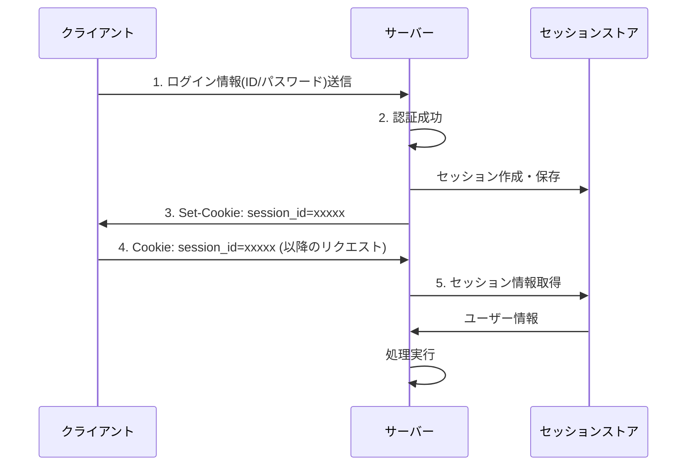
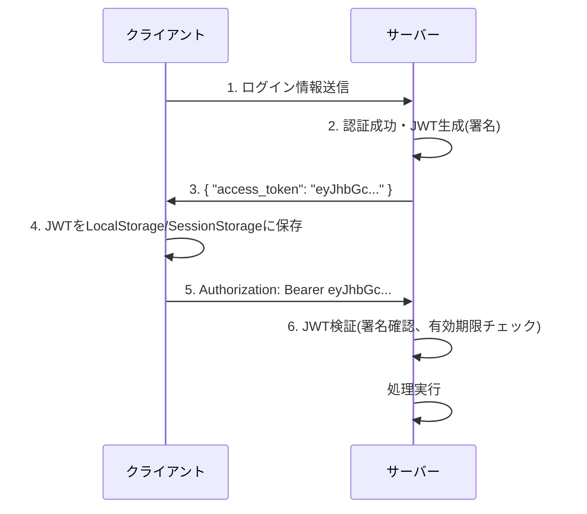
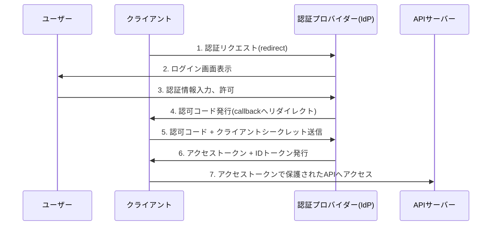
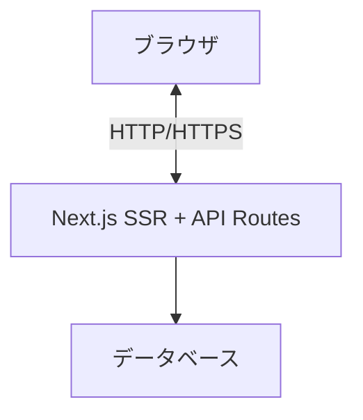
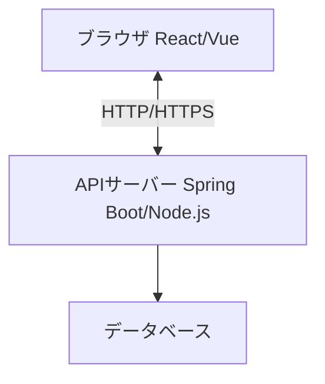
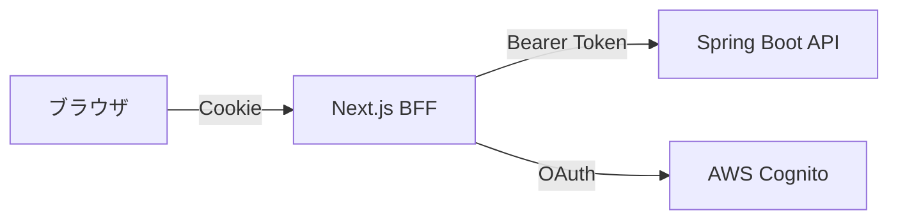
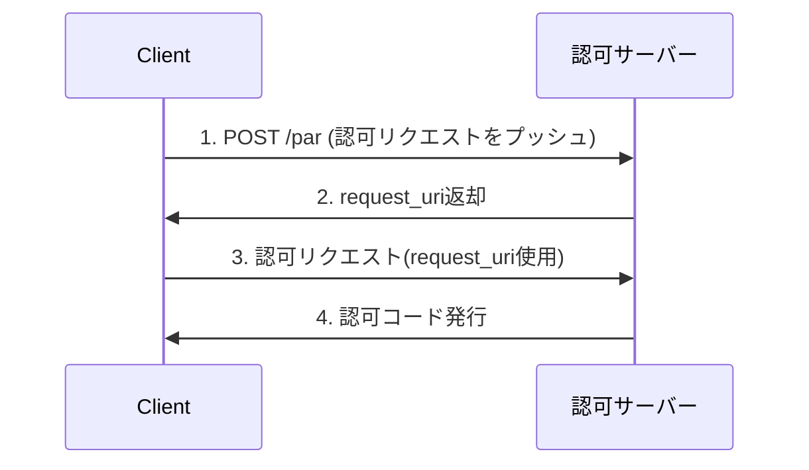

# Webアプリケーションにおける認証機能の包括的リファレンス (2025年版)

> **📖 認証・認可 > 包括的リファレンス**
> 本ドキュメントは、認証機能に関する包括的なリファレンスです。各認証方式の詳細、アーキテクチャパターン、最新セキュリティ技術(PAR、DPoP、mTLS、FAPI等)、レガシーシステムのモダナイゼーションなどを網羅的に解説しています。

## ドキュメントの位置づけ

- **基礎を学ぶ**: [概要](auth-basics.md) → [OAuth 2.0 / OIDC](oauth-oidc-basics.md) → [セキュリティ対策](security-practices.md)
- **実装する**: [実装ガイド](implementation-guide.md)
- **深く理解する**: 本ドキュメント(包括的リファレンス)

## 関連ドキュメント

- **[概要](auth-basics.md)** - 認証・認可の基礎
- **[OAuth 2.0 / OIDC](oauth-oidc-basics.md)** - プロトコルの詳細
- **[セキュリティ対策](security-practices.md)** - 脅威と対策
- **[実装ガイド](implementation-guide.md)** - Next.js + Spring Boot + Cognito の実装

---

## 目次

1. [認証機能の役割](#認証機能の役割)
2. [2025年の最新動向とブラウザ事情](#2025年の最新動向とブラウザ事情)
3. [代表的な認証実装パターン](#代表的な認証実装パターン)
4. [アーキテクチャパターン別の実装方針](#アーキテクチャパターン別の実装方針)
5. [最新セキュリティ強化技術](#最新セキュリティ強化技術)
6. [Next.js + Spring Boot + AWS Cognito構成のベストプラクティス](#nextjs--spring-boot--aws-cognito構成のベストプラクティス)

---

## 認証機能の役割

### 認証(Authentication)とは

認証とは、**「あなたは誰ですか?」**という問いに答えるプロセスです。ユーザーが本人であることを確認し、システムへのアクセスを許可する仕組みです。

### 主な役割

- **本人確認**: ユーザーが主張する身元が正しいことを確認
- **セキュリティ保護**: 不正アクセスからシステムとデータを守る
- **アクセス制御の基盤**: 認証後に適切な権限を付与(認可)
- **監査証跡**: 誰がいつアクセスしたかを記録

### 認証と認可の違い

| 項目 | 認証(Authentication) | 認可(Authorization) |
|------|---------------------|-------------------|
| 問い | 「あなたは誰?」 | 「あなたは何ができる?」 |
| 目的 | 身元確認 | 権限確認 |
| タイミング | アクセス時 | リソース操作時 |
| 例 | ログイン | 管理者画面へのアクセス |

### 関係者と役割(OAuth/OIDC前提)

- **ユーザー(主体)**: 認証を受ける人
- **クライアント**: フロントエンドアプリケーション(ブラウザ/モバイルアプリ)
- **認可サーバ/IdP (Identity Provider)**: 認証とトークン発行を担当(AWS Cognito, Auth0等)
- **リソースサーバ(API)**: ビジネスロジックとデータを提供するバックエンド
- **SP/RP (リライングパーティ)**: IdPを信頼してユーザーを受け入れる側

---

## 2025年の最新動向とブラウザ事情

### サードパーティCookieの段階的廃止

2024年からChromeをはじめとする主要ブラウザでサードパーティCookieの段階的廃止が進んでいます。

#### 影響

- ❌ **従来のサイレントリフレッシュ(隠しiframe)が使えない**
- ❌ **IdPのサードパーティCookie依存SSOが困難に**
- ❌ **クロスサイトでのセッション維持が制限**

#### 対策

- ✅ **BFF(Backend For Frontend)パターンの採用** ← **2025年の主流**
- ✅ **同一サイトCookie運用**
- ✅ **FedCM(Federated Credential Management)の活用** ← Chrome本格導入済み
- ✅ **Authorization Code + PKCE フロー**

### SameSite属性の強化

```javascript
// 推奨Cookie設定
Set-Cookie: session_id=xxx;
  HttpOnly;           // JavaScriptからアクセス不可(XSS対策)
  Secure;             // HTTPS通信のみ
  SameSite=Strict;    // クロスサイトリクエストで送信しない(CSRF対策)
  Max-Age=86400       // 有効期限
```

### その他のセキュリティ強化

- **CSP(Content Security Policy)**: XSS攻撃を防ぐHTTPヘッダー
- **Trusted Types**: DOM操作のサニタイズを強制
- **HSTS**: HTTPS通信を強制

### OAuth 2.1への移行

OAuth 2.1は業界のベストプラクティスを標準化した最新仕様です。

#### 主な変更点

- ✅ **Authorization Code + PKCE を標準化**
- ❌ **Implicit Flow は非推奨(廃止)**
- ❌ **Resource Owner Password Credentials (ROPC) は非推奨**
- ✅ **リダイレクトURIの厳格な一致必須**
- ✅ **state/nonce パラメータ必須化**

---

## 代表的な認証実装パターン

### 1. セッションベース認証

#### セッションベース認証の概要

サーバー側でセッション情報を保持し、クライアントにはセッションIDのみを渡す伝統的な方式。

#### セッションベース認証の通信フロー



#### セッションベース認証のメリット

- ✅ サーバー側でセッションを即座に無効化可能
- ✅ 実装がシンプルで理解しやすい
- ✅ 古いブラウザでも動作
- ✅ セッション情報をサーバー側で完全制御

#### セッションベース認証のデメリット

- ❌ サーバーにセッション保存領域が必要(メモリやRedis)
- ❌ 水平スケーリング時にセッション共有の仕組みが必要
- ❌ CSRF攻撃への対策が必須
- ❌ モバイルアプリでのCookie管理が複雑

#### セッションベース認証の適用シーン

- 管理画面やエンタープライズアプリケーション
- リアルタイムなセッション管理が重要な場合
- フルスタックフレームワーク(Rails, Django, PHP)での実装

#### セッションベース認証の注意ポイント

- **CSRF対策**: CSRFトークンの実装必須
- **セッション固定攻撃**: ログイン成功時にセッションIDを再生成
- **セッションタイムアウト**: 適切な有効期限設定(アイドルと絶対タイムアウトの併用)
- **Secure/HttpOnly/SameSite属性**: Cookieの適切な設定

#### Cookie設定例

```javascript
// Express.js
app.use(session({
  name: 'sessionId',
  secret: process.env.SESSION_SECRET,
  resave: false,
  saveUninitialized: false,
  cookie: {
    secure: true,        // HTTPS必須
    httpOnly: true,      // XSS対策
    sameSite: 'strict',  // CSRF対策
    maxAge: 3600000      // 1時間
  }
}));
```

---

### 2. トークンベース認証(JWT)

#### トークンベース認証の概要

サーバーが署名付きトークン(JWT: JSON Web Token)を発行し、クライアント側で保持する方式。

#### JWTの構造

```text
Header.Payload.Signature
eyJhbGc...(Base64).eyJ1c2Vy...(Base64).SflKxwRJ...(署名)
```

- **Header**: アルゴリズム情報(HS256, RS256など)
- **Payload**: ユーザー情報、有効期限など
- **Signature**: 改ざん検知用の署名

#### トークンベース認証の通信フロー



#### トークンベース認証のメリット

- ✅ ステートレス(サーバー側でセッション保持不要)
- ✅ 水平スケーリングが容易
- ✅ マイクロサービス間での認証情報共有が簡単
- ✅ モバイルアプリとの相性が良い
- ✅ CORS対応が容易

#### トークンベース認証のデメリット

- ❌ トークンの即座な無効化が困難
- ❌ トークンサイズが大きい(毎回送信のオーバーヘッド)
- ❌ XSS攻撃でトークンが盗まれるリスク
- ❌ リフレッシュトークンの管理が必要

#### トークンベース認証の適用シーン

- SPA(Single Page Application) + APIサーバー構成
- マイクロサービスアーキテクチャ
- モバイルアプリのバックエンドAPI
- 複数サービス間での認証情報共有

#### トークンベース認証の注意ポイント

- **トークンの保存場所**: LocalStorage(XSS注意)、HttpOnly Cookie推奨
- **有効期限**: アクセストークンは短め(15分〜1時間)
- **リフレッシュトークン**: 長期間有効なトークンで再発行
- **リフレッシュトークンローテーション**: 使い捨て＋再利用検知でセキュリティ強化
- **署名アルゴリズム**: RS256/ES256(公開鍵方式)推奨、HS256は共通鍵
- **ブラックリスト**: ログアウト時にトークンを無効化リストに追加
- **トークンバインディング**: DPoP/mTLSでトークンをクライアント/接続にバインド

#### トークン保存場所の比較(2025年版)

| 保存場所 | XSS耐性 | CSRF耐性 | リフレッシュ時の消失 | 推奨度 |
|---------|---------|----------|---------------------|--------|
| **HttpOnly Cookie** | ✅ 高 | ⚠️ 要対策 | ❌ なし | **🌟 最推奨** |
| **メモリ(State管理)** | ✅ 高 | ✅ 高 | ❌ あり | ✅ 推奨 |
| SessionStorage | ❌ 低 | ✅ 高 | ❌ あり | ⚠️ 条件付き |
| LocalStorage | ❌ 低 | ✅ 高 | ✅ なし | ❌ 非推奨 |

**2025年の推奨**: BFFパターン(後述)でトークンをサーバー側管理、またはHttpOnly Cookie + メモリの組み合わせ

---

### 3. OAuth 2.0 / OpenID Connect

#### OAuth/OIDCの概要

外部の認証プロバイダー(Google, GitHub, AWS Cognito等)を利用した認証方式。

#### 主要な概念

- **認証プロバイダー(IdP)**: 認証を提供するサービス
- **リソースオーナー**: エンドユーザー
- **クライアント**: あなたのアプリケーション
- **認可サーバー**: トークンを発行するサーバー

#### 通信フロー(認可コードフロー)



#### OAuth/OIDCのメリット

- ✅ パスワード管理不要(IdPが管理)
- ✅ MFA(多要素認証)などのセキュリティ機能が利用可能
- ✅ ソーシャルログイン実装が容易
- ✅ 標準プロトコルで相互運用性が高い
- ✅ ユーザー登録の手間削減

#### OAuth/OIDCのデメリット

- ❌ 外部サービスへの依存
- ❌ 実装が複雑
- ❌ IdPのダウンタイムの影響を受ける
- ❌ プライバシーポリシーやGDPR対応が必要

#### OAuth/OIDCの適用シーン

- B2Cアプリケーション(一般ユーザー向け)
- ソーシャルログインを提供したい場合
- エンタープライズSSOが必要な場合
- 認証基盤を自前で持ちたくない場合

#### OAuth 2.0のフロー選択(2025年版)

| ユースケース | 推奨フロー | 理由 |
|------------|----------|------|
| **ブラウザ(SPA)** | Authorization Code + PKCE | Implicit廃止、サードパーティCookie問題に対応 |
| **サーバーサイドレンダリング** | Authorization Code | シークレット管理可能、セキュア |
| **モバイルアプリ** | Authorization Code + PKCE | システムブラウザ使用、埋め込みWebView禁止 |
| **テレビ/IoT** | Device Authorization Grant | デバイスコードフロー |
| **M2M(サーバー間)** | Client Credentials | mTLS/private_key_jwt推奨 |

#### OAuth/OIDCの注意ポイント

- ❌ **Implicit Flow は使用禁止**(OAuth 2.1で廃止)
- ❌ **Resource Owner Password Credentials (ROPC) も非推奨**
- ✅ **Authorization Code + PKCE**: サーバーサイドでトークン交換(セキュア)
- ✅ **PKCE**: モバイルアプリやSPAでの必須拡張、認可コード横取り攻撃を防止
- ✅ **state パラメータ**: CSRF対策(必須)
- ✅ **nonce**: リプレイアタック対策(OIDC使用時)
- ✅ **スコープ管理**: 必要最小限の権限のみ要求
- ✅ **リダイレクトURIの厳格な一致**: 完全一致のみ許可(ワイルドカード禁止)

---

### 4. 多要素認証(MFA: Multi-Factor Authentication)

#### MFAの概要

複数の認証要素を組み合わせてセキュリティを強化する方式。2025年現在、**パスキー(WebAuthn/FIDO2)** が主流化。

#### 認証の3要素

1. **知識要素**: パスワード、PINコード
2. **所持要素**: スマートフォン、セキュリティキー、パスキー
3. **生体要素**: 指紋、顔認証

#### MFAの実装方式(2025年版推奨順)

| 方式 | フィッシング耐性 | UX | 推奨度 | 備考 |
|------|----------------|-----|--------|------|
| **WebAuthn/パスキー** | ✅ 高 | ✅ 良好 | **🌟 最推奨** | プラットフォーム認証器/セキュリティキー |
| **TOTP** | ⚠️ 中 | ✅ 良好 | ✅ 推奨 | Google Authenticator等 |
| **プッシュ通知** | ✅ 高 | ✅ 良好 | ✅ 推奨 | トランザクション情報表示必須 |
| **SMS/音声** | ❌ 低 | ⚠️ 可 | ⚠️ バックアップ用 | SIMスワッピング攻撃に脆弱 |

#### パスキー(Passkeys)の利点

- ✅ **フィッシング耐性**: ドメインバインディングで偽サイトでは使用不可
- ✅ **パスワード不要**: パスワードレス認証実現
- ✅ **生体認証**: 指紋・顔認証で便利
- ✅ **クロスプラットフォーム**: デバイス間同期可能
- ✅ **業界標準**: Apple, Google, Microsoftが推進

#### 実装例(WebAuthn)

```javascript
// 登録時
const credential = await navigator.credentials.create({
  publicKey: {
    challenge: new Uint8Array(32), // サーバーから取得
    rp: { name: "Example Corp", id: "example.com" },
    user: {
      id: new Uint8Array(16),
      name: "user@example.com",
      displayName: "User Name"
    },
    pubKeyCredParams: [
      { type: "public-key", alg: -7 },  // ES256
      { type: "public-key", alg: -257 } // RS256
    ],
    authenticatorSelection: {
      authenticatorAttachment: "platform", // 生体認証
      userVerification: "required"
    }
  }
});

// 認証時
const assertion = await navigator.credentials.get({
  publicKey: {
    challenge: new Uint8Array(32),
    rpId: "example.com",
    userVerification: "required"
  }
});
```

#### リスクベース/アダプティブ認証

ログインごとにリスク評価を行い、MFAの要求を動的に制御:

- **低リスク**: MFAスキップ(信頼済みデバイス、通常の場所)
- **中リスク**: TOTP/プッシュ通知要求
- **高リスク**: WebAuthn必須、またはアクセスブロック

評価要素:

- IP アドレス、地理的位置
- デバイスフィンガープリント
- 行動パターン(時間帯、操作速度等)
- 脅威インテリジェンス連携

#### ステップアップ認証

重要操作時に追加認証を要求:

```javascript
// 高額送金時など
if (amount > 10000) {
  await requireMFA(); // 追加認証
}
```

#### 注意ポイント

- ⚠️ SMS認証はSIMスワッピング攻撃のリスクあり(バックアップ用途のみ)
- ✅ TOTP、WebAuthnがより安全
- ✅ リカバリーコード/バックアップ認証器の提供が必須
- ✅ MFA疲労攻撃対策: プッシュ通知にトランザクション詳細表示
- ✅ アカウントリカバリーフローの慎重な設計

---

## アーキテクチャパターン別の実装方針

### パターン1: フルスタックフレームワーク(一気通貫実装)

#### パターン1の構成例



#### パターン1の特徴

- フロントエンドとバックエンドが同一サーバー上で動作
- Next.jsのAPI RoutesやServer Actionsで完結
- セッション管理がシンプル

#### パターン1の認証実装の推奨方式

##### セッションベース認証が推奨

理由:

- 同一オリジンなのでCookie管理が簡単
- Next.jsのMiddlewareでセッション検証が容易
- NextAuthやAuth.jsなどのライブラリが充実

#### 実装例(NextAuth使用)

```javascript
// pages/api/auth/[...nextauth].js
import NextAuth from 'next-auth';
import CredentialsProvider from 'next-auth/providers/credentials';

export default NextAuth({
  providers: [
    CredentialsProvider({
      credentials: {
        email: { label: "Email", type: "text" },
        password: { label: "Password", type: "password" }
      },
      async authorize(credentials) {
        // ユーザー認証ロジック
        const user = await validateUser(credentials);
        if (user) {
          return user;
        }
        return null;
      }
    })
  ],
  session: {
    strategy: "jwt", // or "database"
  },
  callbacks: {
    async jwt({ token, user }) {
      if (user) {
        token.id = user.id;
        token.role = user.role;
      }
      return token;
    },
    async session({ session, token }) {
      session.user.id = token.id;
      session.user.role = token.role;
      return session;
    }
  }
});

// middleware.js
import { withAuth } from "next-auth/middleware";

export default withAuth({
  callbacks: {
    authorized({ token }) {
      return !!token;
    },
  },
});

export const config = { matcher: ["/dashboard/:path*"] };
```

#### 注意ポイント

- ✅ **CSRF対策**: フレームワークが自動対応(NextAuthなど)
- ✅ **セキュアなCookie**: HttpOnly, Secure, SameSite属性設定
- ✅ **サーバーサイドレンダリング**: 初期表示時に認証状態を反映
- ⚠️ **APIルートの保護**: 各API Routeで認証チェック
- ⚠️ **環境変数管理**: シークレットキーの適切な管理

---

### パターン2: SPA + APIサーバー(分離構成)

#### 構成例



#### 特徴

- フロントエンドとバックエンドが別サーバー(別ドメイン)
- CORSの考慮が必要
- フロントエンドは静的ファイルとして配信可能

#### 認証実装の推奨方式(2025年版)

**第一選択: BFF(Backend For Frontend)パターン** 🌟

BFFはフロントエンドとバックエンドの間に専用の中間層を置くパターンです。



**BFFの利点**:

- ✅ トークンがブラウザに露出しない(XSS対策)
- ✅ サードパーティCookie問題を回避
- ✅ CORS設定がシンプル
- ✅ トークンリフレッシュをサーバー側で制御
- ✅ セキュリティ境界が明確

**代替案: Authorization Code + PKCE (SPAから直接)**

BFFが使えない場合の選択肢:

- トークンはメモリ(Reactステート等)に保持
- リフレッシュトークンはHttpOnly Cookieに保存
- トークンローテーションと短寿命化必須
- ❌ LocalStorage/SessionStorageは避ける

---

#### 実装例1: BFFパターン(Next.js + Spring Boot)

**フロントエンド側(Next.js BFF)**

```javascript
// app/api/users/profile/route.ts (Next.js 13+ App Router)
import { getServerSession } from 'next-auth';
import { authOptions } from '@/app/api/auth/[...nextauth]/route';

export async function GET() {
  const session = await getServerSession(authOptions);

  if (!session) {
    return Response.json({ error: 'Unauthorized' }, { status: 401 });
  }

  // Spring Boot APIにプロキシ
  const response = await fetch(`${process.env.API_BASE_URL}/users/profile`, {
    headers: {
      'Authorization': `Bearer ${session.idToken}`,
      'Content-Type': 'application/json',
    },
    // キャッシュ戦略
    next: { revalidate: 60 }
  });

  if (!response.ok) {
    return Response.json({ error: 'API Error' }, { status: response.status });
  }

  const data = await response.json();
  return Response.json(data);
}

// クライアント側
// app/dashboard/page.tsx
'use client';
import { useEffect, useState } from 'react';

export default function Dashboard() {
  const [profile, setProfile] = useState(null);

  useEffect(() => {
    // BFF経由でAPIにアクセス(Cookieは自動送信)
    fetch('/api/users/profile')
      .then(res => res.json())
      .then(data => setProfile(data));
  }, []);

  return <div>Welcome {profile?.name}</div>;
}
```

---

#### 実装例2: SPA直接アクセス(React + Spring Boot)

**⚠️ BFFが使えない場合のみ使用**

**フロントエンド側(React)**

```javascript
// authService.js
export const login = async (email, password) => {
  const response = await fetch('https://api.example.com/auth/login', {
    method: 'POST',
    headers: { 'Content-Type': 'application/json' },
    body: JSON.stringify({ email, password })
  });

  const data = await response.json();

  // トークンを保存
  localStorage.setItem('accessToken', data.accessToken);
  localStorage.setItem('refreshToken', data.refreshToken);

  return data;
};

// axiosインスタンス設定
import axios from 'axios';

const apiClient = axios.create({
  baseURL: 'https://api.example.com',
});

// リクエストインターセプター
apiClient.interceptors.request.use((config) => {
  const token = localStorage.getItem('accessToken');
  if (token) {
    config.headers.Authorization = `Bearer ${token}`;
  }
  return config;
});

// レスポンスインターセプター(トークンリフレッシュ)
apiClient.interceptors.response.use(
  (response) => response,
  async (error) => {
    const originalRequest = error.config;

    if (error.response?.status === 401 && !originalRequest._retry) {
      originalRequest._retry = true;

      const refreshToken = localStorage.getItem('refreshToken');
      const response = await axios.post('https://api.example.com/auth/refresh', {
        refreshToken
      });

      const { accessToken } = response.data;
      localStorage.setItem('accessToken', accessToken);

      originalRequest.headers.Authorization = `Bearer ${accessToken}`;
      return apiClient(originalRequest);
    }

    return Promise.reject(error);
  }
);
```

**バックエンド側(Spring Boot)**

```java
// SecurityConfig.java
@Configuration
@EnableWebSecurity
public class SecurityConfig {

    @Bean
    public SecurityFilterChain filterChain(HttpSecurity http) throws Exception {
        http
            .csrf().disable() // JWT使用時はCSRF無効化
            .cors().configurationSource(corsConfigurationSource())
            .and()
            .sessionManagement()
                .sessionCreationPolicy(SessionCreationPolicy.STATELESS) // ステートレス
            .and()
            .authorizeHttpRequests()
                .requestMatchers("/auth/login", "/auth/register").permitAll()
                .anyRequest().authenticated()
            .and()
            .addFilterBefore(jwtAuthenticationFilter(),
                           UsernamePasswordAuthenticationFilter.class);

        return http.build();
    }

    @Bean
    public CorsConfigurationSource corsConfigurationSource() {
        CorsConfiguration configuration = new CorsConfiguration();
        configuration.setAllowedOrigins(Arrays.asList("https://frontend.example.com"));
        configuration.setAllowedMethods(Arrays.asList("GET", "POST", "PUT", "DELETE"));
        configuration.setAllowedHeaders(Arrays.asList("*"));
        configuration.setAllowCredentials(true);

        UrlBasedCorsConfigurationSource source = new UrlBasedCorsConfigurationSource();
        source.registerCorsConfiguration("/**", configuration);
        return source;
    }
}

// JwtAuthenticationFilter.java
@Component
public class JwtAuthenticationFilter extends OncePerRequestFilter {

    @Autowired
    private JwtTokenProvider jwtTokenProvider;

    @Override
    protected void doFilterInternal(HttpServletRequest request,
                                    HttpServletResponse response,
                                    FilterChain filterChain) throws ServletException, IOException {

        String token = extractTokenFromRequest(request);

        if (token != null && jwtTokenProvider.validateToken(token)) {
            Authentication auth = jwtTokenProvider.getAuthentication(token);
            SecurityContextHolder.getContext().setAuthentication(auth);
        }

        filterChain.doFilter(request, response);
    }

    private String extractTokenFromRequest(HttpServletRequest request) {
        String bearerToken = request.getHeader("Authorization");
        if (bearerToken != null && bearerToken.startsWith("Bearer ")) {
            return bearerToken.substring(7);
        }
        return null;
    }
}
```

#### 注意ポイント

**1. トークン保存場所の選択(2025年版)**

| 保存場所 | メリット | デメリット | 推奨度 |
|---------|---------|----------|--------|
| HttpOnly Cookie | XSS攻撃に強い | CSRF対策必要 | ✅ 高 |
| メモリ(State管理) | 最もセキュア | リロードで消失 | ✅ 高(短寿命トークン) |
| SessionStorage | タブ毎に独立 | XSS脆弱、タブ閉じると消失 | ⚠️ 低 |
| LocalStorage | 実装簡単、容量大 | XSS脆弱、永続化 | ❌ **使用禁止** |

**2025年の推奨戦略**:

- **BFFパターン**: トークンをNext.js等のサーバー側で管理(最推奨)
- **SPA直接**: アクセストークンはメモリ、リフレッシュトークンはHttpOnly Cookie

**2. リフレッシュトークンローテーション**

```javascript
// リフレッシュトークンの使い捨て戦略
const refreshAccessToken = async (oldRefreshToken) => {
  const response = await fetch('/auth/refresh', {
    method: 'POST',
    headers: { 'Content-Type': 'application/json' },
    body: JSON.stringify({ refreshToken: oldRefreshToken })
  });

  const { accessToken, refreshToken: newRefreshToken } = await response.json();

  // 新しいリフレッシュトークンで古いものを置き換え
  httpOnlyCookie.set('refreshToken', newRefreshToken);

  return accessToken;
};

// 再利用検知(サーバー側)
if (isRefreshTokenReused(token)) {
  // トークンファミリー全体を無効化(セキュリティ侵害の可能性)
  revokeAllTokensForUser(userId);
  return 401;
}
```

**3. CORS設定**

```java
// 適切なCORS設定
configuration.setAllowedOrigins(Arrays.asList("https://your-frontend.com"));
// ❌ ワイルドカード(*)はAllowCredentials=trueと併用不可
configuration.setAllowCredentials(true);
```

**3. トークン設計(2025年版)**

```yaml
アクセストークン:
  有効期限: 15分〜1時間(短命化)
  保存場所: メモリまたはBFF管理
  用途: API認証
  形式: JWT(署名あり)またはOpaque Token

リフレッシュトークン:
  有効期限: 7〜30日
  保存場所: HttpOnly Cookie または BFF管理
  用途: アクセストークン再発行
  ローテーション: 使い捨て + 再利用検知

IDトークン(OIDC):
  有効期限: 1時間
  用途: ユーザー情報取得
  検証: issuer/audience/nonce必須
```

**4. トークンリフレッシュ戦略**

- アクセストークン: 短命(15分〜1時間)
- リフレッシュトークン: 長命(7日〜30日)
- 自動リフレッシュロジックの実装

**4. XSS対策**

- Content Security Policy(CSP)の設定
- DOMPurifyなどのサニタイズライブラリ使用
- 信頼できない入力値のエスケープ

**5. セキュリティヘッダー**

```java
http.headers()
    .xssProtection()
    .contentSecurityPolicy("default-src 'self'")
    .and()
    .frameOptions().deny()
    .httpStrictTransportSecurity().maxAgeInSeconds(31536000);
```

---

## 最新セキュリティ強化技術

### 1. PAR (Pushed Authorization Requests)

#### 概要

認可リクエストパラメータを事前に認可サーバーへプッシュし、改ざんや漏えいを防ぐ技術。

#### 動作フロー



#### メリット

- ✅ URLパラメータの改ざん防止
- ✅ ブラウザ履歴からの情報漏えい防止
- ✅ リクエストサイズ制限の回避

### 2. JAR/JARM (JWT-Secured Authorization Request/Response Mode)

#### JAR (JWT-Secured Authorization Request)

認可リクエストをJWT化して署名:

```javascript
// 認可リクエストをJWT化
const request = jwt.sign({
  response_type: 'code',
  client_id: 'xxx',
  redirect_uri: 'https://app.example.com/callback',
  scope: 'openid profile',
  state: 'xyz',
  nonce: 'abc'
}, privateKey, { algorithm: 'RS256' });

// 認可エンドポイントへ
location.href = `${authServer}/authorize?request=${request}`;
```

#### JARM (JWT-Secured Authorization Response Mode)

認可レスポンスをJWT化して改ざん検知:

- ミックスアップ攻撃(異なるASからのレスポンス混入)を防止
- レスポンスの完全性保証

### 3. DPoP (Demonstrating Proof-of-Possession)

#### 概要

アクセストークンをクライアントの秘密鍵にバインドし、トークン盗難時の悪用を防ぐ。

#### 仕組み

```javascript
// 1. DPoP Proofを生成(リクエストごと)
const dpopProof = jwt.sign({
  jti: uuid(),
  htm: 'GET',              // HTTPメソッド
  htu: 'https://api.example.com/users',  // リクエストURI
  iat: Date.now()
}, clientPrivateKey, {
  algorithm: 'ES256',
  header: { typ: 'dpop+jwt', jwk: clientPublicKeyJWK }
});

// 2. APIリクエスト
fetch('https://api.example.com/users', {
  headers: {
    'Authorization': `DPoP ${accessToken}`,
    'DPoP': dpopProof
  }
});
```

#### メリット

- ✅ トークンが盗まれても秘密鍵なしでは使用不可
- ✅ トークンリプレイ攻撃の防止
- ✅ 中間者攻撃への耐性向上

### 4. mTLS (Mutual TLS)

#### 概要

クライアント証明書を使った相互TLS認証。

#### 用途

- M2M(Machine-to-Machine)通信
- 高セキュリティ要件の金融API(FAPI準拠)
- トークンのクライアントバインディング

```java
// Spring Boot でのmTLS設定
@Configuration
public class MtlsConfig {
    @Bean
    public SecurityFilterChain filterChain(HttpSecurity http) {
        http
            .x509()
                .subjectPrincipalRegex("CN=(.*?)(?:,|$)")
                .userDetailsService(userDetailsService());

        return http.build();
    }
}
```

### 5. FAPI (Financial-grade API)

#### 概要

金融業界向けの厳格なOAuth/OIDC実装プロファイル。

#### 要件

- ✅ PAR必須
- ✅ JAR/JARM使用
- ✅ DPoP または mTLS によるトークンバインディング
- ✅ 短寿命アクセストークン(推奨10分以下)
- ✅ 厳格なリダイレクトURI検証
- ✅ state/nonce必須

### 6. Shared Signals / CAEP (Continuous Access Evaluation Protocol)

#### 概要

セキュリティイベントをリアルタイムで共有し、継続的なアクセス評価を実現。

#### ユースケース

- ユーザーがパスワード変更 → 全セッション無効化
- 不正アクセス検知 → 該当ユーザーの全トークン取り消し
- デバイス紛失報告 → 該当デバイスからのアクセス拒否

```javascript
// セキュリティイベントの受信
app.post('/security-events', (req, res) => {
  const event = req.body;

  if (event.type === 'session-revoked') {
    revokeUserSessions(event.subject);
  }

  res.status(202).send();
});
```

### 7. 典型的な脅威と対策まとめ(2025年版)

| 脅威 | 対策 |
|------|------|
| **フィッシング** | WebAuthn/パスキー、ドメインバインディング |
| **MFA疲労攻撃** | プッシュ通知にトランザクション詳細表示、数値マッチング |
| **トークン窃取** | BFF、DPoP/mTLS、短寿命化、HttpOnly Cookie |
| **トークンリプレイ** | DPoP、nonce、jti(JWT ID) |
| **XSS** | CSP、Trusted Types、HttpOnly Cookie、トークンはメモリのみ |
| **CSRF** | SameSite Cookie、CSRFトークン、Origin/Referer検証 |
| **セッション固定化** | ログイン成功時のセッションID再生成 |
| **セッション乗っ取り** | デバイス/IP異常検知、アクティブセッション管理 |
| **ミックスアップ攻撃** | issuer検証、JARM、state検証 |
| **認可コード横取り** | PKCE必須化 |
| **オープンリダイレクタ** | リダイレクトURI厳格一致、ホワイトリスト |

---

## Next.js + Spring Boot + AWS Cognito構成のベストプラクティス

### システム構成図(2025年版 - BFFパターン)

```mermaid
graph TB
    Browser[ブラウザ]
    NextJS[Next.js<br/>- フロントエンドUI<br/>- BFF Backend for Frontend<br/>- トークン管理]
    Cognito[AWS Cognito<br/>Identity Provider<br/>- 認証・MFA<br/>- トークン発行<br/>- パスキー対応]
    SpringBoot[Spring Boot API<br/>- ビジネスロジック<br/>- データアクセス<br/>- トークン検証]
    DB[データベース]

    Browser -->|① Cookie(HttpOnly/Secure)| NextJS
    NextJS -->|② Authorization Code + PKCE| Cognito
    Cognito -->|IDトークン/アクセストークン| NextJS
    NextJS -->|③ Bearer Token| SpringBoot
    SpringBoot --> DB

    style NextJS fill:#e1f5ff
    style Cognito fill:#fff3e0
```

**重要**: このアーキテクチャは2025年のベストプラクティス(BFF、PKCE、サードパーティCookie非依存)に準拠しています。

---

### アーキテクチャの特徴

#### 各コンポーネントの役割

**1. Next.js (フロントエンド + BFF)**

- ユーザーインターフェース(React/SSR)
- 認証フローの開始・管理(Authorization Code + PKCE)
- Spring Boot APIへのプロキシ(BFFパターン)
- トークンの安全な管理(サーバー側セッション)
- ブラウザとの通信はHttpOnly Cookie(XSS対策)

**2. AWS Cognito (IdP)**

- ユーザー登録・認証(メール/パスワード、ソーシャル)
- IDトークン、アクセストークン、リフレッシュトークンの発行
- MFA(多要素認証)提供: TOTP、SMS、WebAuthn/パスキー
- ソーシャルログイン統合(Google, Facebook等)
- アダプティブ認証(異常検知、リスクベース)

**3. Spring Boot (APIサーバー)**

- ビジネスロジック実行
- データ操作(CRUD)
- Cognitoトークンの検証(JWT署名検証、issuer/audience確認)
- 認可制御(ロールベースアクセス制御)
- セキュリティヘッダー設定

---

### ベストプラクティス(2025年版)

#### 1. 認証フローの実装

**必須: Authorization Code Flow with PKCE**

❌ **Implicit Flowは使用禁止**(OAuth 2.1で廃止)

✅ **PKCE(Proof Key for Code Exchange)の利点**:

- 認可コード横取り攻撃を防止
- クライアントシークレット不要(SPAでも安全)
- すべてのOAuth 2.1実装で必須化

**実装手順**

**Step 1: Next.jsでの認証設定(NextAuth使用)**

```javascript
// pages/api/auth/[...nextauth].js
import NextAuth from 'next-auth';
import CognitoProvider from 'next-auth/providers/cognito';

export default NextAuth({
  providers: [
    CognitoProvider({
      clientId: process.env.COGNITO_CLIENT_ID,
      clientSecret: process.env.COGNITO_CLIENT_SECRET,
      issuer: process.env.COGNITO_ISSUER, // https://cognito-idp.{region}.amazonaws.com/{userPoolId}
      checks: ['pkce', 'state'], // PKCEとCSRF対策
    })
  ],
  session: {
    strategy: 'jwt',
    maxAge: 30 * 24 * 60 * 60, // 30 days
  },
  callbacks: {
    async jwt({ token, account, profile }) {
      // Cognitoからのトークンをセッションに保存
      if (account) {
        token.accessToken = account.access_token;
        token.idToken = account.id_token;
        token.refreshToken = account.refresh_token;
        token.sub = profile.sub;
      }
      return token;
    },
    async session({ session, token }) {
      // クライアント側で使用するセッション情報
      session.accessToken = token.accessToken;
      session.idToken = token.idToken;
      session.user.id = token.sub;
      return session;
    }
  },
  pages: {
    signIn: '/auth/signin',
    error: '/auth/error',
  }
});
```

**Step 2: API呼び出し時のトークン付与**

```javascript
// lib/apiClient.js
import { getSession } from 'next-auth/react';
import axios from 'axios';

export const apiClient = axios.create({
  baseURL: process.env.NEXT_PUBLIC_API_URL,
});

// BFFパターン: Next.js API Routeを経由
// pages/api/proxy/[...path].js
import { getServerSession } from "next-auth/next";
import { authOptions } from "../auth/[...nextauth]";

export default async function handler(req, res) {
  const session = await getServerSession(req, res, authOptions);

  if (!session) {
    return res.status(401).json({ error: 'Unauthorized' });
  }

  // Spring Bootへプロキシリクエスト
  const apiUrl = `${process.env.API_BASE_URL}${req.query.path.join('/')}`;

  try {
    const response = await fetch(apiUrl, {
      method: req.method,
      headers: {
        'Content-Type': 'application/json',
        'Authorization': `Bearer ${session.idToken}`, // IDトークンを送信
      },
      body: req.method !== 'GET' ? JSON.stringify(req.body) : undefined,
    });

    const data = await response.json();
    res.status(response.status).json(data);
  } catch (error) {
    res.status(500).json({ error: 'API request failed' });
  }
}

// クライアント側の使用例
// components/UserProfile.jsx
import { useSession } from 'next-auth/react';
import { useEffect, useState } from 'react';

export default function UserProfile() {
  const { data: session } = useSession();
  const [profile, setProfile] = useState(null);

  useEffect(() => {
    if (session) {
      // BFF経由でAPIにアクセス
      fetch('/api/proxy/users/profile')
        .then(res => res.json())
        .then(data => setProfile(data));
    }
  }, [session]);

  if (!session) return <div>Please sign in</div>;

  return (
    <div>
      <h1>Welcome {session.user.name}</h1>
      {profile && <pre>{JSON.stringify(profile, null, 2)}</pre>}
    </div>
  );
}
```

**Step 3: Spring BootでのCognitoトークン検証**

```java
// build.gradle
dependencies {
    implementation 'org.springframework.boot:spring-boot-starter-security'
    implementation 'org.springframework.boot:spring-boot-starter-oauth2-resource-server'
}

// application.yml
spring:
  security:
    oauth2:
      resourceserver:
        jwt:
          issuer-uri: https://cognito-idp.ap-northeast-1.amazonaws.com/${COGNITO_USER_POOL_ID}
          jwk-set-uri: https://cognito-idp.ap-northeast-1.amazonaws.com/${COGNITO_USER_POOL_ID}/.well-known/jwks.json

// SecurityConfig.java
@Configuration
@EnableWebSecurity
@EnableMethodSecurity
public class SecurityConfig {

    @Bean
    public SecurityFilterChain filterChain(HttpSecurity http) throws Exception {
        http
            .csrf(csrf -> csrf.disable()) // JWT使用時
            .cors(cors -> cors.configurationSource(corsConfigurationSource()))
            .sessionManagement(session ->
                session.sessionCreationPolicy(SessionCreationPolicy.STATELESS))
            .authorizeHttpRequests(auth -> auth
                .requestMatchers("/health", "/actuator/**").permitAll()
                .anyRequest().authenticated()
            )
            .oauth2ResourceServer(oauth2 -> oauth2
                .jwt(jwt -> jwt
                    .jwtAuthenticationConverter(jwtAuthenticationConverter())
                )
            );

        return http.build();
    }

    @Bean
    public JwtAuthenticationConverter jwtAuthenticationConverter() {
        JwtAuthenticationConverter converter = new JwtAuthenticationConverter();

        // Cognitoのグループをロールに変換
        JwtGrantedAuthoritiesConverter authoritiesConverter =
            new JwtGrantedAuthoritiesConverter();
        authoritiesConverter.setAuthoritiesClaimName("cognito:groups");
        authoritiesConverter.setAuthorityPrefix("ROLE_");

        converter.setJwtGrantedAuthoritiesConverter(authoritiesConverter);
        return converter;
    }

    @Bean
    public CorsConfigurationSource corsConfigurationSource() {
        CorsConfiguration configuration = new CorsConfiguration();
        configuration.setAllowedOrigins(
            Arrays.asList(
                "http://localhost:3000",  // 開発環境
                "https://your-app.com"     // 本番環境
            )
        );
        configuration.setAllowedMethods(Arrays.asList("GET", "POST", "PUT", "DELETE", "OPTIONS"));
        configuration.setAllowedHeaders(Arrays.asList("*"));
        configuration.setAllowCredentials(true);

        UrlBasedCorsConfigurationSource source = new UrlBasedCorsConfigurationSource();
        source.registerCorsConfiguration("/**", configuration);
        return source;
    }
}

// コントローラーでの使用例
@RestController
@RequestMapping("/api/users")
public class UserController {

    @GetMapping("/profile")
    public ResponseEntity<UserProfile> getProfile(
        @AuthenticationPrincipal Jwt jwt
    ) {
        String userId = jwt.getSubject(); // Cognito User ID
        String email = jwt.getClaim("email");
        List<String> groups = jwt.getClaim("cognito:groups");

        UserProfile profile = userService.getProfile(userId);
        return ResponseEntity.ok(profile);
    }

    @PreAuthorize("hasRole('Admin')")
    @GetMapping("/admin")
    public ResponseEntity<List<User>> getAllUsers() {
        return ResponseEntity.ok(userService.getAllUsers());
    }
}
```

---

#### 2. トークン管理戦略(2025年版)

**IDトークン vs アクセストークン vs リフレッシュトークン**

| トークン | 用途 | 送信先 | 有効期限 | 保存場所(BFF) |
|---------|------|--------|---------|--------------|
| IDトークン | ユーザー情報、API認証 | Spring Boot API | 1時間 | Next.jsサーバーセッション |
| アクセストークン | Cognito User Pool API | AWS Cognito | 1時間 | Next.jsサーバーセッション |
| リフレッシュトークン | トークン更新 | AWS Cognito | 30日 | Next.jsサーバーセッション |

**BFFパターンの実装(推奨)**

Next.jsをBFF(Backend for Frontend)として使用し、トークンをサーバーサイドで管理:

```javascript
// middleware.ts (Next.js 13+)
import { withAuth } from "next-auth/middleware";

export default withAuth({
  callbacks: {
    authorized({ token }) {
      return !!token;
    },
  },
});

export const config = {
  matcher: [
    '/dashboard/:path*',
    '/api/proxy/:path*',
  ],
};
```

**メリット**:

- ✅ トークンがブラウザに公開されない(XSS対策)
- ✅ CORS設定がシンプル(Next.js ↔ Spring Bootのみ)
- ✅ トークンリフレッシュをサーバーサイドで制御
- ✅ Next.jsでレスポンスをキャッシュ可能
- ✅ サードパーティCookie問題を回避(2025年の必須対応)
- ✅ リフレッシュトークンローテーションを安全に実装可能

**セッション vs JWT戦略**:

```javascript
// NextAuth設定
session: {
  strategy: 'jwt',  // 推奨: ステートレス、スケーラブル
  // strategy: 'database',  // 代替: より厳格な管理が必要な場合
  maxAge: 30 * 24 * 60 * 60, // 30日
}
```

---

#### 3. AWS Cognito設定のベストプラクティス(2025年版)

**ユーザープール設定**

```terraform
# Terraform例
resource "aws_cognito_user_pool" "main" {
  name = "your-app-user-pool"

  # パスワードポリシー(NIST 800-63B準拠)
  password_policy {
    minimum_length    = 12  # 最小12文字推奨(2025年)
    require_lowercase = true
    require_uppercase = true
    require_numbers   = true
    require_symbols   = true
    temporary_password_validity_days = 1
  }

  # MFA設定
  mfa_configuration = "OPTIONAL"  # "ON"で必須化も可能

  software_token_mfa_configuration {
    enabled = true  # TOTP(Google Authenticator等)
  }

  # WebAuthn/パスキー対応(2024年以降対応)
  # user_pool_add_ons {
  #   advanced_security_mode = "ENFORCED"  # これで有効化
  # }

  # アカウント回復
  account_recovery_setting {
    recovery_mechanism {
      name     = "verified_email"
      priority = 1
    }
    # recovery_mechanism {
    #   name     = "verified_phone_number"  # オプション
    #   priority = 2
    # }
  }

  # 属性検証
  auto_verified_attributes = ["email"]

  # メール設定(SESを使用推奨 - 送信制限回避)
  email_configuration {
    email_sending_account = "DEVELOPER"
    source_arn           = aws_ses_email_identity.main.arn
    reply_to_email_address = "noreply@example.com"
  }

  # ユーザー属性
  schema {
    name                = "email"
    attribute_data_type = "String"
    required            = true
    mutable             = true
  }

  # Lambda Trigger(カスタマイズ)
  lambda_config {
    pre_authentication       = aws_lambda_function.pre_auth.arn
    post_authentication      = aws_lambda_function.post_auth.arn
    pre_token_generation     = aws_lambda_function.pre_token.arn
    custom_message          = aws_lambda_function.custom_message.arn
  }

  # デバイス記憶(信頼済みデバイス管理)
  device_configuration {
    challenge_required_on_new_device      = true
    device_only_remembered_on_user_prompt = true
  }
}

# アプリクライアント設定(2025年版 - OAuth 2.1準拠)
resource "aws_cognito_user_pool_client" "nextjs" {
  name         = "nextjs-client"
  user_pool_id = aws_cognito_user_pool.main.id

  # ❌ Implicitフローは使用禁止
  # ✅ Authorization Codeのみ許可
  allowed_oauth_flows                  = ["code"]
  allowed_oauth_flows_user_pool_client = true
  allowed_oauth_scopes                 = ["openid", "email", "profile", "aws.cognito.signin.user.admin"]

  # コールバックURL(厳格な一致必須)
  callback_urls = [
    "http://localhost:3000/api/auth/callback/cognito",  # 開発
    "https://your-app.com/api/auth/callback/cognito"    # 本番
  ]

  logout_urls = [
    "http://localhost:3000",
    "https://your-app.com"
  ]

  # トークン有効期限(2025年推奨)
  access_token_validity  = 1   # 1時間(短寿命推奨)
  id_token_validity      = 1   # 1時間
  refresh_token_validity = 30  # 30日

  token_validity_units {
    access_token  = "hours"
    id_token      = "hours"
    refresh_token = "days"
  }

  # PKCEサポート(必須)
  explicit_auth_flows = [
    "ALLOW_REFRESH_TOKEN_AUTH",
    "ALLOW_USER_SRP_AUTH",        # Secure Remote Password
    # "ALLOW_CUSTOM_AUTH"          # カスタム認証フロー用
  ]

  # セキュリティ強化
  prevent_user_existence_errors = "ENABLED"  # ユーザー列挙攻撃対策

  # リフレッシュトークンローテーション(2025年推奨)
  enable_token_revocation = true

  # Read/Write属性の制御
  read_attributes  = ["email", "email_verified", "name"]
  write_attributes = ["name"]
}

# ドメイン設定(カスタムドメイン推奨)
resource "aws_cognito_user_pool_domain" "main" {
  domain       = "auth"
  user_pool_id = aws_cognito_user_pool.main.id
  certificate_arn = aws_acm_certificate.auth.arn  # カスタムドメイン用
}
```

**重要なセキュリティ設定(2025年版)**

1. **Advanced Security Features(必須)**

```terraform
resource "aws_cognito_user_pool" "main" {
  # 高度なセキュリティ機能
  user_pool_add_ons {
    advanced_security_mode = "ENFORCED"  # AUDIT or ENFORCED
  }
}
```

機能:

- ✅ **アダプティブ認証**: 異常なログインパターン検知
- ✅ **漏洩パスワード検知**: 既知の漏洩パスワードをブロック
- ✅ **リスクベースMFA**: リスクに応じて自動でMFA要求

2. **WAF統合(推奨)**

```terraform
# Cognito Hosted UIをWAFで保護
resource "aws_wafv2_web_acl_association" "cognito" {
  resource_arn = aws_cognito_user_pool.main.arn
  web_acl_arn  = aws_wafv2_web_acl.main.arn
}
```

3. **ログとモニタリング**

```terraform
# CloudWatch Logsへの出力
resource "aws_cloudwatch_log_group" "cognito" {
  name              = "/aws/cognito/${aws_cognito_user_pool.main.name}"
  retention_in_days = 30
}
```

---

#### 4. エラーハンドリングとログアウト

**トークン期限切れ対応**

```javascript
// Next.js API Route
// pages/api/proxy/[...path].js
export default async function handler(req, res) {
  const session = await getServerSession(req, res, authOptions);

  if (!session) {
    return res.status(401).json({ error: 'Unauthorized' });
  }

  try {
    const response = await fetch(apiUrl, {
      headers: {
        'Authorization': `Bearer ${session.idToken}`,
      },
    });

    if (response.status === 401) {
      // トークン期限切れ、リフレッシュ試行
      const refreshed = await refreshCognitoToken(session.refreshToken);

      if (refreshed) {
        // 再試行
        const retryResponse = await fetch(apiUrl, {
          headers: {
            'Authorization': `Bearer ${refreshed.idToken}`,
          },
        });
        return res.status(retryResponse.status).json(await retryResponse.json());
      } else {
        // リフレッシュ失敗、再ログイン必要
        return res.status(401).json({ error: 'Session expired' });
      }
    }

    return res.status(response.status).json(await response.json());
  } catch (error) {
    console.error('API Error:', error);
    return res.status(500).json({ error: 'Internal server error' });
  }
}
```

**グローバルログアウト実装**

```javascript
// Cognitoからもログアウト
import { signOut } from 'next-auth/react';

const handleLogout = async () => {
  // NextAuthセッション削除
  await signOut({
    callbackUrl: '/login',
    redirect: true
  });

  // Cognito Hosted UIからもログアウト(オプション)
  const cognitoDomain = process.env.NEXT_PUBLIC_COGNITO_DOMAIN;
  const clientId = process.env.NEXT_PUBLIC_COGNITO_CLIENT_ID;
  const logoutUri = encodeURIComponent(window.location.origin);

  window.location.href =
    `${cognitoDomain}/logout?client_id=${clientId}&logout_uri=${logoutUri}`;
};
```

---

#### 5. セキュリティチェックリスト(2025年版)

**Next.js側**

- [ ] 環境変数の適切な管理(.env.local、AWS Secrets Manager)
- [ ] HTTPS通信の強制(本番環境)
- [ ] Content Security Policy設定(CSP)
- [ ] PKCE有効化(必須)
- [ ] state パラメータでCSRF対策(必須)
- [ ] セッションタイムアウト設定(アイドル+絶対)
- [ ] BFFパターンでトークンをサーバー側管理
- [ ] Cookie属性: HttpOnly, Secure, SameSite=Strict
- [ ] 依存関係の定期更新(npm audit)
- [ ] セキュリティヘッダー: HSTS, X-Frame-Options等

**Spring Boot側**

- [ ] JWTトークン検証の実装(署名、issuer、audience、exp)
- [ ] CORSの適切な設定(ワイルドカード禁止、Originホワイトリスト)
- [ ] セキュリティヘッダーの設定
- [ ] ロールベースアクセス制御(@PreAuthorize)
- [ ] APIレート制限(Bucket4j等)
- [ ] ログ・監査証跡の記録(CloudWatch Logs)
- [ ] 入力値のバリデーション・サニタイズ
- [ ] SQLインジェクション対策(PreparedStatement)
- [ ] JWKSキャッシング(パフォーマンス)
- [ ] 例外ハンドリング(詳細情報の漏えい防止)

**AWS Cognito側**

- [ ] 強力なパスワードポリシー(12文字以上)
- [ ] MFA有効化(TOTP/WebAuthn推奨、SMS非推奨)
- [ ] Advanced Security Features有効化(ENFORCED)
- [ ] 適切なトークン有効期限(アクセス1時間、リフレッシュ30日)
- [ ] Lambdaトリガーでのカスタム検証
- [ ] CloudWatch Logsでモニタリング
- [ ] WAF統合(DDoS、ボット対策)
- [ ] リダイレクトURI厳格一致(完全一致のみ)
- [ ] prevent_user_existence_errors有効化
- [ ] カスタムドメイン使用(auth.your-app.com)
- [ ] SES統合(メール送信制限回避)
- [ ] デバイス記憶機能の活用

**運用・監視**

- [ ] 異常なログインパターンの検知とアラート
- [ ] アクティブセッション管理と強制ログアウト機能
- [ ] セキュリティインシデント対応計画
- [ ] 定期的なセキュリティ監査
- [ ] ペネトレーションテスト実施
- [ ] OWASP Top 10対策の確認
- [ ] GDPR/個人情報保護法対応
- [ ] バックアップ・リカバリー手順の整備

---

#### 6. パフォーマンス最適化

**1. トークンキャッシング**

```java
// Spring Boot: JWK Set をキャッシュ
@Configuration
public class JwtDecoderConfig {

    @Bean
    public JwtDecoder jwtDecoder() {
        String jwkSetUri = "https://cognito-idp.ap-northeast-1.amazonaws.com/"
                         + userPoolId + "/.well-known/jwks.json";

        NimbusJwtDecoder jwtDecoder = NimbusJwtDecoder
            .withJwkSetUri(jwkSetUri)
            .cache(Caffeine.newBuilder()  // キャッシュ追加
                .maximumSize(100)
                .expireAfterWrite(10, TimeUnit.MINUTES)
                .build())
            .build();

        return jwtDecoder;
    }
}
```

**2. BFFでのレスポンスキャッシュ**

```javascript
// Next.js API Route with cache
export const config = {
  runtime: 'edge',
};

export default async function handler(req) {
  const session = await getServerSession(req);

  if (!session) {
    return new Response('Unauthorized', { status: 401 });
  }

  // キャッシュ戦略
  const response = await fetch(apiUrl, {
    headers: {
      'Authorization': `Bearer ${session.idToken}`,
    },
    next: { revalidate: 60 } // 60秒キャッシュ
  });

  return response;
}
```

---

#### 7. 開発・デプロイフロー

**環境分離**

```bash
# 開発環境
COGNITO_USER_POOL_ID=ap-northeast-1_dev
COGNITO_CLIENT_ID=dev_client_id
API_BASE_URL=http://localhost:8080

# ステージング環境
COGNITO_USER_POOL_ID=ap-northeast-1_stg
COGNITO_CLIENT_ID=stg_client_id
API_BASE_URL=https://api-stg.your-app.com

# 本番環境
COGNITO_USER_POOL_ID=ap-northeast-1_prod
COGNITO_CLIENT_ID=prod_client_id
API_BASE_URL=https://api.your-app.com
```

**CI/CDでのデプロイ例**

```yaml
# GitHub Actions
name: Deploy

on:
  push:
    branches: [main]

jobs:
  deploy-nextjs:
    runs-on: ubuntu-latest
    steps:
      - uses: actions/checkout@v3

      - name: Deploy to Vercel
        uses: amondnet/vercel-action@v25
        with:
          vercel-token: ${{ secrets.VERCEL_TOKEN }}
          vercel-org-id: ${{ secrets.VERCEL_ORG_ID }}
          vercel-project-id: ${{ secrets.VERCEL_PROJECT_ID }}

  deploy-spring-boot:
    runs-on: ubuntu-latest
    steps:
      - uses: actions/checkout@v3

      - name: Deploy to AWS ECS
        # ... ECS deployment steps
```

---

### まとめ: Next.js + Spring Boot + Cognito 構成のポイント(2025年版)

#### ✅ この構成が優れている理由

1. **2025年のベストプラクティス準拠**
   - BFFパターンによるトークン管理(サードパーティCookie非依存)
   - Authorization Code + PKCE(OAuth 2.1準拠)
   - パスキー/WebAuthn対応可能
   - リフレッシュトークンローテーション

2. **責務の分離**
   - Next.js: UI/UX、BFF、トークン管理
   - Cognito: 認証基盤、MFA、リスクベース認証
   - Spring Boot: ビジネスロジック、認可制御

3. **セキュリティ**
   - トークンをNext.jsサーバー側で管理(XSS対策)
   - HttpOnly/Secure/SameSite Cookie(CSRF対策)
   - Cognitoによる堅牢な認証(Advanced Security)
   - 標準プロトコル(OAuth 2.0/OIDC)準拠
   - WAF/CloudWatch統合で防御と監視

4. **スケーラビリティ**
   - ステートレス設計(JWT戦略)
   - マネージドサービス(Cognito)活用
   - マイクロサービス化も容易
   - 水平スケーリング対応

5. **開発効率**
   - NextAuth/Auth.jsで簡単統合
   - Spring SecurityのOAuth2自動設定
   - AWS CDK/Terraformでインフラコード化
   - 豊富なエコシステムとコミュニティ

#### ⚠️ 注意すべき落とし穴

1. **コスト**: Cognitoの料金体系(MAU課金、50,000 MAUまで無料)
2. **ロックイン**: AWS依存度が高い(移行コスト)
3. **複雑性**: 3層構造のデバッグの難しさ、分散トレーシング必須
4. **レイテンシ**: BFF経由のオーバーヘッド(キャッシング戦略で緩和)
5. **リージョン制約**: Cognitoの一部機能がリージョン限定
6. **カスタマイズ限界**: Cognito Hosted UIのカスタマイズ制約

#### 🚀 推奨される次のステップ

**セキュリティ強化**:

1. PAR/JAR/JARMの導入検討(高セキュリティ要件時)
2. DPoPによるトークンバインディング
3. Shared Signals/CAEPでリアルタイムセッション管理
4. FedCM対応(将来のブラウザ標準)

**運用改善**:
5. Cognitoのカスタムクレームを活用した細かい権限制御
6. Cognitoグループ機能でロール管理(RBAC)
7. AWS WAF + Shield Advancedで DDoS対策
8. CloudWatch/X-Ray/OpenTelemetryで監視・トレーシング
9. Chaos Engineering/障害テスト

**UX改善**:
10. パスキー(WebAuthn)の積極導入
11. アダプティブ認証によるシームレスなMFA
12. ソーシャルログイン拡充
13. アカウントリンク機能(複数IdP統合)

**開発プロセス**:
14. E2Eテスト自動化(Playwright/Cypress + Cognito Local)
15. セキュリティテスト自動化(OWASP ZAP)
16. CI/CDパイプラインの強化
17. ブルーグリーンデプロイ/カナリアリリース

---

## 参考リソース

### 標準仕様・RFC

- [OAuth 2.0 RFC 6749](https://datatracker.ietf.org/doc/html/rfc6749)
- [OAuth 2.1 Draft](https://datatracker.ietf.org/doc/html/draft-ietf-oauth-v2-1-10)
- [PKCE RFC 7636](https://datatracker.ietf.org/doc/html/rfc7636)
- [OpenID Connect Core 1.0](https://openid.net/specs/openid-connect-core-1_0.html)
- [DPoP RFC 9449](https://datatracker.ietf.org/doc/html/rfc9449)
- [PAR RFC 9126](https://datatracker.ietf.org/doc/html/rfc9126)

### セキュリティガイドライン

- [OWASP Authentication Cheat Sheet](https://cheatsheetseries.owasp.org/cheatsheets/Authentication_Cheat_Sheet.html)
- [NIST 800-63B Digital Identity Guidelines](https://pages.nist.gov/800-63-3/sp800-63b.html)
- [FAPI Security Profile](https://openid.net/specs/openid-financial-api-part-2-1_0.html)
- [OAuth 2.0 Security Best Current Practice](https://datatracker.ietf.org/doc/html/draft-ietf-oauth-security-topics)

### フレームワーク・ライブラリ

- [NextAuth.js / Auth.js Documentation](https://next-auth.js.org/)
- [Spring Security OAuth 2.0](https://spring.io/guides/tutorials/spring-boot-oauth2)
- [AWS Cognito Developer Guide](https://docs.aws.amazon.com/cognito/latest/developerguide/)
- [WebAuthn Guide](https://webauthn.guide/)

### 最新情報

- [OAuth Working Group](https://datatracker.ietf.org/wg/oauth/documents/)
- [OpenID Foundation](https://openid.net/)
- [FedCM (Federated Credential Management)](https://fedidcg.github.io/FedCM/)

---

## 2025年の認証実装まとめ

### 最重要ポイント

1. **BFFパターン + Authorization Code + PKCE** が実務上の安定解
2. **パスキー(WebAuthn)** を第一選択のMFAに
3. **Implicit Flow / ROPC は使用禁止** (OAuth 2.1で廃止)
4. **サードパーティCookie非依存** の設計(FedCM検討)
5. **リフレッシュトークンローテーション** 必須
6. **トークン短寿命化 + バインディング**(DPoP/mTLS)
7. **リスクベース/アダプティブ認証** でUXとセキュリティ両立

### アーキテクチャ選択の指針

| ユースケース | 推奨アーキテクチャ | 認証方式 |
|------------|------------------|---------|
| フルスタックアプリ | Next.js SSR | セッション + OIDC |
| SPA + API | **BFFパターン** | Authorization Code + PKCE |
| モバイルアプリ | ネイティブ + API | Authorization Code + PKCE (システムブラウザ) |
| エンタープライズ | SSO統合 | OIDC / SAML 2.0 |
| M2M | API間通信 | Client Credentials + mTLS |

### レガシーからの移行

従来のセッションベースやImplicit Flow使用アプリは、以下の段階的移行を推奨:

1. **Phase 1**: PKCE追加、state/nonce必須化
2. **Phase 2**: BFFパターン導入、トークン管理のサーバー側移行
3. **Phase 3**: リフレッシュトークンローテーション実装
4. **Phase 4**: WebAuthn/パスキー導入
5. **Phase 5**: PAR/DPoP等の高度なセキュリティ機能追加

---

**作成日**: 2025年10月15日
**最終更新**: 2025年10月15日
**対象読者**: Webアプリケーション開発初心者〜中級者
**想定構成**: Next.js + Spring Boot + AWS Cognito
**準拠標準**: OAuth 2.1, OIDC, NIST 800-63B, OWASP

---

<sub>**[キーワード]**

Web認証 2025, BFFパターン, OAuth 2.1, PKCE, パスキー, WebAuthn, サードパーティCookie, DPoP, リフレッシュトークンローテーション, Next.js認証, AWS Cognito, Spring Security, OIDC, セキュリティベストプラクティス</sub>
