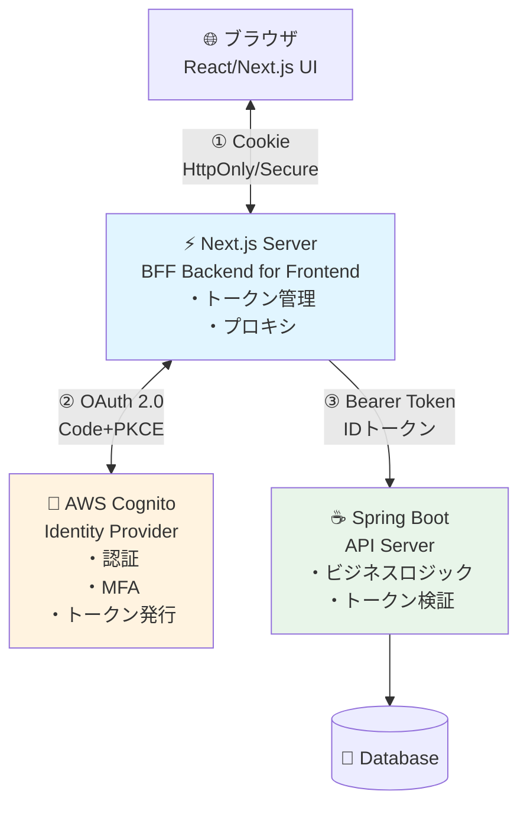
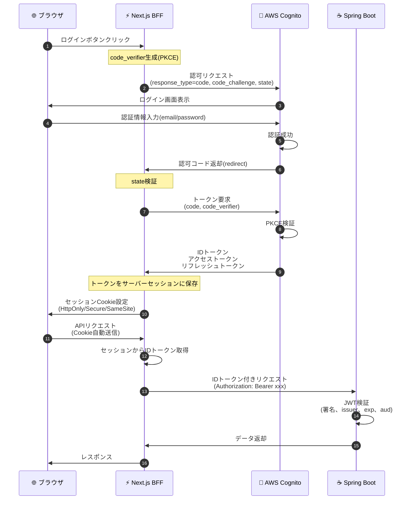
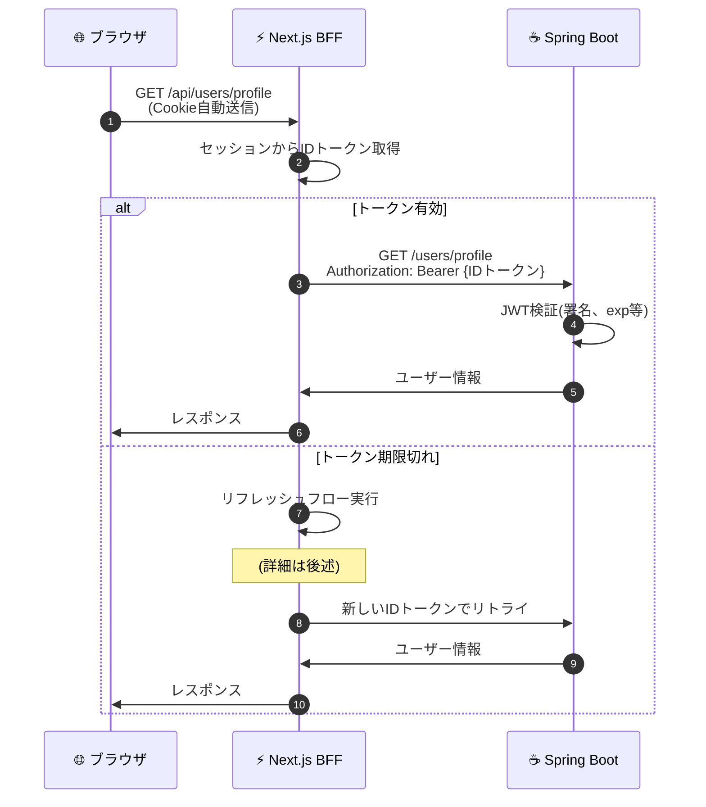
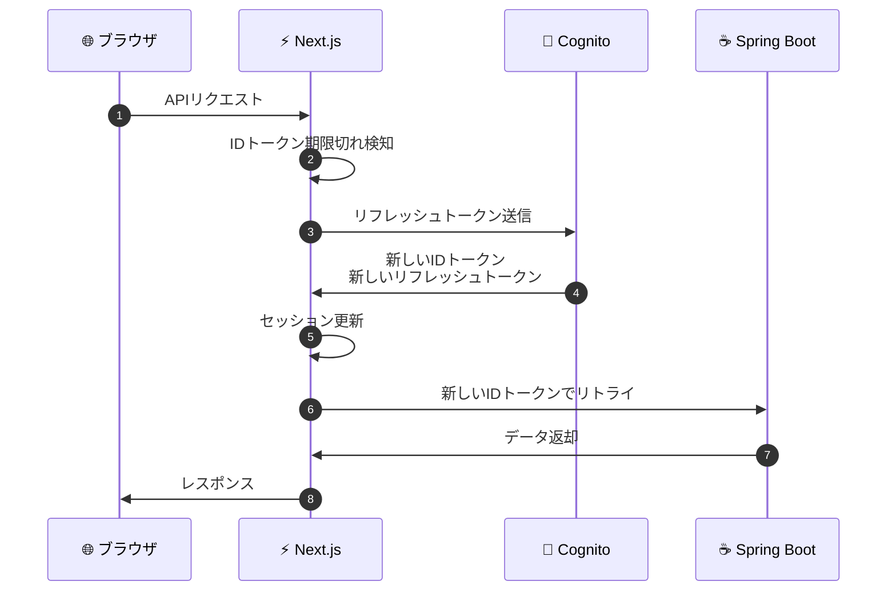

# Next.js + Spring Boot + AWS Cognito 認証実装ガイド

> **📘 認証・認可 > 実装ガイド**
> 本ドキュメントでは、Next.js + Spring Boot + AWS Cognito を使った認証機能の実装方法を解説します。BFFパターンによる実装、通信フローの詳細、具体的なコード例を提供します。

## 前提知識

以下のドキュメントを先に読むことを推奨します:

1. **[概要](auth-basics.md)** - 認証と認可の基礎
2. **[OAuth 2.0 / OIDC](oauth-oidc-basics.md)** - プロトコルの詳細
3. **[セキュリティ対策](security-practices.md)** - 脅威と対策

## 関連ドキュメント

- 詳細: **[包括的リファレンス](authentication-guide.md)** - アーキテクチャパターン、最新技術

---

## 目次

1. [システム構成](#システム構成)
2. [認証フロー全体像](#認証フロー全体像)
3. [実装: AWS Cognito 設定](#実装-aws-cognito-設定)
4. [実装: Next.js(BFF)](#実装-nextjsbff)
5. [実装: Spring Boot API](#実装-spring-boot-api)
6. [補足: トークンリフレッシュ](#補足-トークンリフレッシュ)
7. [補足: エラーハンドリング](#補足-エラーハンドリング)
8. [まとめとチェックリスト](#まとめとチェックリスト)

---

## システム構成

### アーキテクチャ図(BFFパターン)



### 各コンポーネントの役割

| コンポーネント | 役割 | 技術スタック |
|-------------|------|------------|
| **ブラウザ** | UI表示、ユーザー操作 | React, TypeScript |
| **Next.js(BFF)** | ・認証フロー管理<br/>・トークン管理(サーバー側)<br/>・API プロキシ | Next.js 14+, NextAuth |
| **AWS Cognito** | ・認証・認可<br/>・トークン発行<br/>・MFA | AWS Cognito User Pool |
| **Spring Boot** | ・ビジネスロジック<br/>・データアクセス<br/>・トークン検証 | Spring Boot 3.x, Spring Security |

### なぜBFFパターンなのか？

**2025年の必須要件:**

- ✅ サードパーティCookie廃止への対応
- ✅ トークンをブラウザに露出させない(XSS対策)
- ✅ CORS設定がシンプル
- ✅ リフレッシュトークンを安全に管理

---

## 認証フロー全体像

### 1. 初回ログインフロー



### フローのポイント

#### ① ブラウザ → Next.js

- **Cookie**: HttpOnly/Secure/SameSite=Strict
- **メリット**: XSS攻撃でトークンが盗まれない

#### ② Next.js → Cognito (Authorization Code + PKCE)

- **PKCE**: 認可コード横取り攻撃を防止
- **state**: CSRF攻撃を防止
- **OAuth 2.1準拠**: Implicit Flow は廃止

#### ③ Next.js → Spring Boot

- **Bearer Token**: IDトークンまたはアクセストークン
- **BFFが仲介**: トークンはブラウザに届かない

---

### 2. 通常のAPIアクセスフロー



---

## 実装: AWS Cognito 設定

### 1. ユーザープール作成

```hcl
# Terraform example
resource "aws_cognito_user_pool" "main" {
  name = "myapp-user-pool"

  # パスワードポリシー(NIST 800-63B準拠)
  password_policy {
    minimum_length    = 12
    require_lowercase = true
    require_uppercase = true
    require_numbers   = true
    require_symbols   = true
  }

  # MFA設定
  mfa_configuration = "OPTIONAL"

  software_token_mfa_configuration {
    enabled = true  # TOTP(Authenticator)
  }

  # メール検証
  auto_verified_attributes = ["email"]

  # Advanced Security(異常検知、リスクベース認証)
  user_pool_add_ons {
    advanced_security_mode = "ENFORCED"
  }

  # アカウント回復
  account_recovery_setting {
    recovery_mechanism {
      name     = "verified_email"
      priority = 1
    }
  }
}
```

### 2. アプリクライアント作成

```hcl
resource "aws_cognito_user_pool_client" "nextjs" {
  name         = "nextjs-client"
  user_pool_id = aws_cognito_user_pool.main.id

  # ❌ Implicit Flow は使用禁止
  # ✅ Authorization Code のみ
  allowed_oauth_flows                  = ["code"]
  allowed_oauth_flows_user_pool_client = true

  # スコープ
  allowed_oauth_scopes = [
    "openid",
    "email",
    "profile",
    "aws.cognito.signin.user.admin"
  ]

  # コールバックURL(完全一致必須)
  callback_urls = [
    "http://localhost:3000/api/auth/callback/cognito",
    "https://yourapp.com/api/auth/callback/cognito"
  ]

  logout_urls = [
    "http://localhost:3000",
    "https://yourapp.com"
  ]

  # トークン有効期限(2025年推奨)
  access_token_validity  = 1   # 1時間
  id_token_validity      = 1   # 1時間
  refresh_token_validity = 30  # 30日

  token_validity_units {
    access_token  = "hours"
    id_token      = "hours"
    refresh_token = "days"
  }

  # PKCE対応
  explicit_auth_flows = [
    "ALLOW_REFRESH_TOKEN_AUTH",
    "ALLOW_USER_SRP_AUTH"
  ]

  # セキュリティ
  prevent_user_existence_errors = "ENABLED"
  enable_token_revocation       = true  # リフレッシュトークンローテーション
}
```

### 3. 設定情報の確認

```bash
# ユーザープールID
User Pool ID: ap-northeast-1_xxxxxxxxx

# アプリクライアントID
Client ID: xxxxxxxxxxxxxxxxxxxx

# Issuer URL(IDトークン検証用)
Issuer: https://cognito-idp.ap-northeast-1.amazonaws.com/ap-northeast-1_xxxxxxxxx

# JWKs URL(公開鍵取得)
JWKS URI: https://cognito-idp.ap-northeast-1.amazonaws.com/ap-northeast-1_xxxxxxxxx/.well-known/jwks.json
```

---

## 実装: Next.js(BFF)

### 1. NextAuth 設定

```bash
# パッケージインストール
npm install next-auth
```

```typescript
// app/api/auth/[...nextauth]/route.ts
import NextAuth from "next-auth";
import CognitoProvider from "next-auth/providers/cognito";

export const authOptions = {
  providers: [
    CognitoProvider({
      clientId: process.env.COGNITO_CLIENT_ID!,
      clientSecret: process.env.COGNITO_CLIENT_SECRET!,
      issuer: process.env.COGNITO_ISSUER!,
      // PKCE + state 自動設定
      checks: ["pkce", "state"],
    })
  ],

  session: {
    strategy: "jwt",  // ステートレス
    maxAge: 30 * 24 * 60 * 60, // 30日
  },

  callbacks: {
    // トークンをセッションに保存
    async jwt({ token, account, profile }) {
      if (account) {
        token.accessToken = account.access_token;
        token.idToken = account.id_token;
        token.refreshToken = account.refresh_token;
        token.expiresAt = account.expires_at;
        token.sub = profile?.sub;
      }
      return token;
    },

    // クライアント側で使用するセッション情報
    async session({ session, token }) {
      session.user.id = token.sub as string;
      session.accessToken = token.accessToken;
      session.idToken = token.idToken;
      session.error = token.error;
      return session;
    }
  },

  pages: {
    signIn: '/auth/signin',
    error: '/auth/error',
  }
};

const handler = NextAuth(authOptions);
export { handler as GET, handler as POST };
```

### 2. 環境変数設定

```bash
# .env.local
COGNITO_CLIENT_ID=xxxxxxxxxxxxxxxxxxxx
COGNITO_CLIENT_SECRET=yyyyyyyyyyyyyyyyyyyy
COGNITO_ISSUER=https://cognito-idp.ap-northeast-1.amazonaws.com/ap-northeast-1_xxxxxxxxx
NEXTAUTH_URL=http://localhost:3000
NEXTAUTH_SECRET=<generate-random-secret>

# バックエンドAPI URL
API_BASE_URL=http://localhost:8080
```

### 3. BFF: API プロキシ

```typescript
// app/api/users/profile/route.ts
import { getServerSession } from "next-auth";
import { authOptions } from "@/app/api/auth/[...nextauth]/route";
import { NextRequest, NextResponse } from "next/server";

export async function GET(request: NextRequest) {
  // セッションチェック
  const session = await getServerSession(authOptions);

  if (!session || !session.idToken) {
    return NextResponse.json(
      { error: "Unauthorized" },
      { status: 401 }
    );
  }

  // Spring Boot API にプロキシ
  try {
    const response = await fetch(
      `${process.env.API_BASE_URL}/users/profile`,
      {
        method: "GET",
        headers: {
          "Authorization": `Bearer ${session.idToken}`,
          "Content-Type": "application/json",
        },
        // キャッシュ戦略(オプション)
        next: { revalidate: 60 }
      }
    );

    if (!response.ok) {
      throw new Error(`API Error: ${response.status}`);
    }

    const data = await response.json();
    return NextResponse.json(data);

  } catch (error) {
    console.error("API Proxy Error:", error);
    return NextResponse.json(
      { error: "API request failed" },
      { status: 500 }
    );
  }
}
```

### 4. クライアント側の実装

```typescript
// app/dashboard/page.tsx
"use client";

import { useSession } from "next-auth/react";
import { useEffect, useState } from "react";

export default function Dashboard() {
  const { data: session, status } = useSession();
  const [profile, setProfile] = useState<any>(null);

  useEffect(() => {
    if (status === "authenticated") {
      // BFF経由でAPIにアクセス
      // Cookieは自動送信されるため、Authorization不要
      fetch("/api/users/profile")
        .then(res => {
          if (!res.ok) throw new Error("API Error");
          return res.json();
        })
        .then(data => setProfile(data))
        .catch(err => console.error(err));
    }
  }, [status]);

  if (status === "loading") {
    return <div>Loading...</div>;
  }

  if (status === "unauthenticated") {
    return <div>Please sign in</div>;
  }

  return (
    <div>
      <h1>Welcome {session?.user?.name}</h1>
      {profile && (
        <pre>{JSON.stringify(profile, null, 2)}</pre>
      )}
    </div>
  );
}
```

### 5. Middleware でルート保護

```typescript
// middleware.ts
import { withAuth } from "next-auth/middleware";

export default withAuth({
  callbacks: {
    authorized({ token }) {
      return !!token;
    },
  },
});

export const config = {
  matcher: [
    "/dashboard/:path*",
    "/api/users/:path*",
    "/api/proxy/:path*",
  ],
};
```

---

## 実装: Spring Boot API

### 1. 依存関係追加

```gradle
// build.gradle
dependencies {
    implementation 'org.springframework.boot:spring-boot-starter-web'
    implementation 'org.springframework.boot:spring-boot-starter-security'
    implementation 'org.springframework.boot:spring-boot-starter-oauth2-resource-server'
}
```

### 2. application.yml 設定

```yaml
spring:
  security:
    oauth2:
      resourceserver:
        jwt:
          # Cognito の Issuer URL
          issuer-uri: https://cognito-idp.ap-northeast-1.amazonaws.com/ap-northeast-1_xxxxxxxxx
          # JWKs エンドポイント(公開鍵取得)
          jwk-set-uri: https://cognito-idp.ap-northeast-1.amazonaws.com/ap-northeast-1_xxxxxxxxx/.well-known/jwks.json
```

### 3. Security 設定

```java
package com.example.config;

import org.springframework.context.annotation.Bean;
import org.springframework.context.annotation.Configuration;
import org.springframework.security.config.annotation.method.configuration.EnableMethodSecurity;
import org.springframework.security.config.annotation.web.builders.HttpSecurity;
import org.springframework.security.config.annotation.web.configuration.EnableWebSecurity;
import org.springframework.security.config.http.SessionCreationPolicy;
import org.springframework.security.oauth2.server.resource.authentication.JwtAuthenticationConverter;
import org.springframework.security.oauth2.server.resource.authentication.JwtGrantedAuthoritiesConverter;
import org.springframework.security.web.SecurityFilterChain;
import org.springframework.web.cors.CorsConfiguration;
import org.springframework.web.cors.CorsConfigurationSource;
import org.springframework.web.cors.UrlBasedCorsConfigurationSource;

import java.util.Arrays;

@Configuration
@EnableWebSecurity
@EnableMethodSecurity
public class SecurityConfig {

    @Bean
    public SecurityFilterChain filterChain(HttpSecurity http) throws Exception {
        http
            // CSRF無効化(JWT使用時)
            .csrf(csrf -> csrf.disable())

            // CORS設定
            .cors(cors -> cors.configurationSource(corsConfigurationSource()))

            // ステートレス
            .sessionManagement(session ->
                session.sessionCreationPolicy(SessionCreationPolicy.STATELESS))

            // 認証ルール
            .authorizeHttpRequests(auth -> auth
                .requestMatchers("/health", "/actuator/**").permitAll()
                .anyRequest().authenticated()
            )

            // JWT検証
            .oauth2ResourceServer(oauth2 -> oauth2
                .jwt(jwt -> jwt
                    .jwtAuthenticationConverter(jwtAuthenticationConverter())
                )
            );

        return http.build();
    }

    /**
     * Cognitoのグループをロールに変換
     */
    @Bean
    public JwtAuthenticationConverter jwtAuthenticationConverter() {
        JwtAuthenticationConverter converter = new JwtAuthenticationConverter();

        JwtGrantedAuthoritiesConverter authoritiesConverter =
            new JwtGrantedAuthoritiesConverter();

        // Cognito のグループ claim を使用
        authoritiesConverter.setAuthoritiesClaimName("cognito:groups");
        authoritiesConverter.setAuthorityPrefix("ROLE_");

        converter.setJwtGrantedAuthoritiesConverter(authoritiesConverter);
        return converter;
    }

    /**
     * CORS設定(重要: ワイルドカード禁止)
     */
    @Bean
    public CorsConfigurationSource corsConfigurationSource() {
        CorsConfiguration configuration = new CorsConfiguration();

        // 許可するオリジン(Next.js BFF)
        configuration.setAllowedOrigins(Arrays.asList(
            "http://localhost:3000",    // 開発環境
            "https://yourapp.com"        // 本番環境
        ));

        configuration.setAllowedMethods(Arrays.asList(
            "GET", "POST", "PUT", "DELETE", "OPTIONS"
        ));

        configuration.setAllowedHeaders(Arrays.asList("*"));
        configuration.setAllowCredentials(true);
        configuration.setMaxAge(3600L);

        UrlBasedCorsConfigurationSource source = new UrlBasedCorsConfigurationSource();
        source.registerCorsConfiguration("/**", configuration);
        return source;
    }
}
```

### 4. Controller 実装

```java
package com.example.controller;

import org.springframework.security.access.prepost.PreAuthorize;
import org.springframework.security.core.annotation.AuthenticationPrincipal;
import org.springframework.security.oauth2.jwt.Jwt;
import org.springframework.web.bind.annotation.*;

@RestController
@RequestMapping("/users")
public class UserController {

    /**
     * ユーザープロフィール取得
     */
    @GetMapping("/profile")
    public UserProfile getProfile(@AuthenticationPrincipal Jwt jwt) {
        // JWT から情報を取得
        String userId = jwt.getSubject();  // Cognito User ID
        String email = jwt.getClaim("email");
        String name = jwt.getClaim("name");

        // ビジネスロジック
        UserProfile profile = userService.getProfile(userId);

        return profile;
    }

    /**
     * 管理者のみアクセス可能
     */
    @PreAuthorize("hasRole('Admin')")
    @GetMapping("/admin")
    public List<User> getAllUsers() {
        return userService.getAllUsers();
    }

    /**
     * ユーザー情報更新
     */
    @PutMapping("/profile")
    public UserProfile updateProfile(
        @AuthenticationPrincipal Jwt jwt,
        @RequestBody UserProfileUpdateRequest request
    ) {
        String userId = jwt.getSubject();

        // 更新処理
        return userService.updateProfile(userId, request);
    }
}
```

### 5. JWT 検証の詳細

Spring Securityが自動的に以下を検証:

```java
// 自動検証される項目
- ✅ 署名の正当性(JWKSの公開鍵で検証)
- ✅ 有効期限(exp claim)
- ✅ 発行者(iss claim)
- ✅ Not Before(nbf claim)
- ✅ Issued At(iat claim)

// 手動で追加検証する場合
@Bean
public JwtDecoder jwtDecoder() {
    NimbusJwtDecoder jwtDecoder = NimbusJwtDecoder
        .withJwkSetUri(jwkSetUri)
        .build();

    // Audience(aud)検証
    OAuth2TokenValidator<Jwt> audienceValidator =
        new DelegatingOAuth2TokenValidator<>(
            JwtValidators.createDefaultWithIssuer(issuerUri),
            new AudienceValidator("your-client-id")
        );

    jwtDecoder.setJwtValidator(audienceValidator);
    return jwtDecoder;
}
```

---

## 補足: トークンリフレッシュ

### リフレッシュフロー



### NextAuth でのトークンリフレッシュ実装

```typescript
// app/api/auth/[...nextauth]/route.ts
async jwt({ token, account, profile }) {
  // 初回ログイン時
  if (account) {
    token.accessToken = account.access_token;
    token.idToken = account.id_token;
    token.refreshToken = account.refresh_token;
    token.expiresAt = account.expires_at; // Unix timestamp
    token.sub = profile?.sub;
    return token;
  }

  // トークン有効期限チェック
  const now = Math.floor(Date.now() / 1000);
  const expiresAt = token.expiresAt as number;

  // まだ有効
  if (now < expiresAt) {
    return token;
  }

  // 期限切れ → リフレッシュ
  try {
    const response = await fetch(
      `${process.env.COGNITO_ISSUER}/oauth2/token`,
      {
        method: "POST",
        headers: {
          "Content-Type": "application/x-www-form-urlencoded",
        },
        body: new URLSearchParams({
          grant_type: "refresh_token",
          refresh_token: token.refreshToken as string,
          client_id: process.env.COGNITO_CLIENT_ID!,
          client_secret: process.env.COGNITO_CLIENT_SECRET!,
        }),
      }
    );

    if (!response.ok) {
      throw new Error("Token refresh failed");
    }

    const refreshed = await response.json();

    return {
      ...token,
      accessToken: refreshed.access_token,
      idToken: refreshed.id_token,
      refreshToken: refreshed.refresh_token ?? token.refreshToken,
      expiresAt: Math.floor(Date.now() / 1000) + refreshed.expires_in,
    };
  } catch (error) {
    console.error("Error refreshing token:", error);
    return {
      ...token,
      error: "RefreshTokenError",
    };
  }
}
```

---

## 補足: エラーハンドリング

### 1. 認証エラー(401)

```typescript
// Next.js BFF
export async function GET(request: NextRequest) {
  const session = await getServerSession(authOptions);

  if (!session) {
    return NextResponse.json(
      {
        error: "Unauthorized",
        message: "Please sign in"
      },
      { status: 401 }
    );
  }

  // セッションにエラーがある場合(リフレッシュ失敗等)
  if (session.error === "RefreshTokenError") {
    return NextResponse.json(
      {
        error: "SessionExpired",
        message: "Please sign in again"
      },
      { status: 401 }
    );
  }

  // ...
}
```

### 2. Spring Boot側のエラーハンドリング

```java
@RestControllerAdvice
public class GlobalExceptionHandler {

    /**
     * JWT検証失敗
     */
    @ExceptionHandler(JwtException.class)
    public ResponseEntity<ErrorResponse> handleJwtException(JwtException ex) {
        return ResponseEntity
            .status(HttpStatus.UNAUTHORIZED)
            .body(new ErrorResponse(
                "INVALID_TOKEN",
                "Invalid or expired token"
            ));
    }

    /**
     * 権限不足
     */
    @ExceptionHandler(AccessDeniedException.class)
    public ResponseEntity<ErrorResponse> handleAccessDenied(AccessDeniedException ex) {
        return ResponseEntity
            .status(HttpStatus.FORBIDDEN)
            .body(new ErrorResponse(
                "INSUFFICIENT_PERMISSIONS",
                "You don't have permission to access this resource"
            ));
    }
}
```

---

## まとめとチェックリスト

### 実装の重要ポイント

#### ✅ Next.js(BFF)

- [ ] NextAuth で Authorization Code + PKCE 実装
- [ ] トークンをサーバーセッションで管理
- [ ] BFF パターンで API プロキシ
- [ ] Cookie: HttpOnly/Secure/SameSite
- [ ] トークンリフレッシュ実装

#### ✅ Spring Boot

- [ ] OAuth2 Resource Server として設定
- [ ] JWT 自動検証(署名、issuer、exp)
- [ ] CORS 適切に設定(ワイルドカード禁止)
- [ ] ロールベースアクセス制御(@PreAuthorize)
- [ ] ステートレス設計

#### ✅ AWS Cognito

- [ ] OAuth 2.1 準拠設定(Code + PKCE)
- [ ] Implicit Flow 無効化
- [ ] リダイレクトURI 完全一致
- [ ] トークン有効期限適切(アクセス1h、リフレッシュ30d)
- [ ] Advanced Security 有効化

### セキュリティチェックリスト

- [ ] トークンが LocalStorage に保存されていない
- [ ] PKCE + state + nonce 使用
- [ ] HTTPS 通信(本番環境)
- [ ] CSP(Content Security Policy)設定
- [ ] APIレート制限
- [ ] ログ・監査証跡
- [ ] 定期的な依存関係更新

### 次のステップ

1. **MFA実装**: TOTP、WebAuthn/パスキー
2. **リスクベース認証**: 異常検知、アダプティブMFA
3. **高度なセキュリティ**: PAR、DPoP、mTLS (詳細は[包括的リファレンス](authentication-guide.md)参照)
4. **監視・運用**: CloudWatch、X-Ray、アラート

---

## 参考資料

### 公式ドキュメント

- [NextAuth.js](https://next-auth.js.org/)
- [Spring Security OAuth2](https://spring.io/guides/tutorials/spring-boot-oauth2)
- [AWS Cognito](https://docs.aws.amazon.com/cognito/)

### 標準仕様

- [OAuth 2.1](https://datatracker.ietf.org/doc/html/draft-ietf-oauth-v2-1-10)
- [OpenID Connect](https://openid.net/specs/openid-connect-core-1_0.html)
- [PKCE RFC 7636](https://datatracker.ietf.org/doc/html/rfc7636)

---

**最終更新**: 2025年10月15日
**対象読者**: 認証機能の実装を担当する開発者
